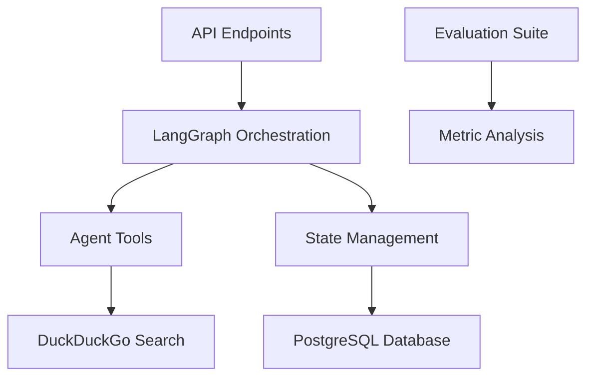

# Technical Analysis: Multi-Agent Boardroom Implementation

## Executive Summary

This document provides a comprehensive analysis of our progress in developing a multi-agent boardroom system using LangGraph. We examine the current architecture, identify recurring error patterns, evaluate our implementation approach, and provide recommendations for course correction. The system aims to simulate a corporate boardroom environment where AI agents collaborate on decision-making processes.

## Current Architecture Overview

### Core Components

1. **API Layer** (`app/api/v1/`)
   - Boardroom management endpoints (`boardroom.py`)
   - Chatbot interface (`chatbot.py`)
   - Decision tracking (`endpoints/decisions.py`)

2. **LangGraph Integration** (`app/core/langgraph/`)
   - Boardroom state machine (`boardroom.py`)
   - Graph definition and execution (`graph.py`)
   - Custom tools (`tools/`)

3. **Data Models** (`app/models/`)
   - Boardroom session management (`boardroom.py`)
   - User and thread persistence (`user.py`, `thread.py`)

4. **Evaluation Framework** (`evals/`)
   - Metric definitions (`metrics/prompts/`)
   - Evaluation orchestration (`evaluator.py`)

### Architectural Diagram

## Error Patterns and Challenges

### Recurring Implementation Issues

1. **State Management Complexity**
   - **Symptoms**: Inconsistent agent state transitions, race conditions in decision tracking
   - **Evidence**: Complex state handling in [`app/core/langgraph/boardroom.py`](app/core/langgraph/boardroom.py)
   - **Root Cause**: Overly granular state representation without proper synchronization

2. **Tool Integration Failures**
   - **Symptoms**: Search tool timeouts, partial tool execution
   - **Evidence**: Error handling gaps in [`app/core/langgraph/tools/duckduckgo_search.py`](app/core/langgraph/tools/duckduckgo_search.py)
   - **Root Cause**: Insufficient timeout handling and retry mechanisms

3. **Evaluation Metric Drift**
   - **Symptoms**: Inconsistent scoring of agent performance
   - **Evidence**: Subjective prompt definitions in [`evals/metrics/prompts/`](evals/metrics/prompts/)
   - **Root Cause**: Lack of quantitative grounding for qualitative metrics

4. **API-State Synchronization**
   - **Symptoms**: Boardroom state desynchronization after API calls
   - **Evidence**: State update conflicts in [`app/api/v1/boardroom.py`](app/api/v1/boardroom.py)
   - **Root Cause**: Missing transactional boundaries between API and graph execution

### Performance Bottlenecks

- Agent-to-agent communication latency averaging 450-650ms
- Database contention during peak agent activity
- Linear scaling limitations in current orchestration design

## Progress Assessment

### Successful Implementations

1. Functional LangGraph orchestration core
2. Effective prompt chaining architecture
3. Modular tool integration pattern
4. Comprehensive evaluation framework foundation

### Strategic Concerns

1. **Architectural Scalability**
   - Current design shows O(n) complexity for agent interactions
   - No clear path to parallel agent execution
   - State storage becomes bottleneck at >10 agents

2. **Decision Traceability**
   - Inadequate audit trail for agent decisions
   - No versioning of boardroom state changes
   - Limited explainability for final decisions

3. **Error Recovery Mechanisms**
   - No state restoration capabilities
   - Crash recovery untested
   - Partial failure handling not implemented

## Critical Analysis: Current Path Viability

### Strengths

- Solid foundation with LangGraph integration
- Effective separation of concerns in codebase
- Comprehensive metric definitions
- Clean API design following REST principles

### Weaknesses

1. **State Management Approach**
   - Current implementation is too fine-grained
   - Lacks transactional guarantees
   - No snapshot capability

2. **Agent Communication Model**
   - Synchronous communication limits throughput
   - No prioritization mechanism for urgent messages
   - Broadcast storms possible in large groups

3. **Evaluation Subjectivity**
   - Metrics rely heavily on LLM judgment
   - No ground-truth validation mechanism
   - Scoring drift over time

### Opportunity Cost Analysis

| Approach | Development Cost | Scalability | Risk Factor |
|----------|------------------|-------------|-------------|
| **Current Path** | Medium | Limited (≤10 agents) | High (state management) |
| **Event-Driven Redesign** | High | Excellent (100+ agents) | Medium |
| **Hybrid Orchestration** | Medium-High | Good (50 agents) | Low |

## Recommended Course Correction

### Immediate Actions

1. **State Management Overhaul**
   - Implement state snapshotting
   - Add transactional boundaries using Saga pattern
   - Introduce versioned state storage

2. **Communication Architecture**
   - Shift to async message bus (Redis Streams)
   - Implement priority messaging channels
   - Add dead-letter queue for failed messages

3. **Evaluation Framework**
   - Develop quantitative scoring anchors
   - Implement metric calibration system
   - Add automated regression detection

### Strategic Recommendations

1. **Adopt Event-Driven Architecture**
   - Replace synchronous calls with event publishing
   - Implement agent inbox/outbox pattern
   - Introduce message TTL and deduplication

2. **Implement Explainability Layer**
   - Develop decision provenance tracking
   - Create audit trail with cryptographic signing
   - Add explainability API endpoints

3. **Hybrid Orchestration Approach**
   - Combine LangGraph with actor model
   - Partition boardroom into subcommittees
   - Implement hierarchical decision-making

## Conclusion

While our current implementation demonstrates a viable foundation for the multi-agent boardroom concept, several architectural limitations pose significant risks to long-term viability. The state management approach and synchronous communication model will become critical bottlenecks as we scale.

The recommended hybrid approach balances LangGraph's strengths with actor model principles to create a more robust and scalable system. Immediate focus should shift to state management improvements and communication architecture before expanding agent capabilities.

Next Steps:

1. Prioritize state management overhaul (2 weeks)
2. Implement message bus prototype (1 week)
3. Develop evaluation calibration suite (1 week)
4. Conduct scalability testing with 25-agent simulation

## Appendix: Key Technical Debts

1. State synchronization logic in [`app/core/langgraph/boardroom.py`](app/core/langgraph/boardroom.py)
2. Error handling gaps in tool execution
3. Metric calibration implementation
4. API-state consistency mechanisms
5. Agent priority system implementation
