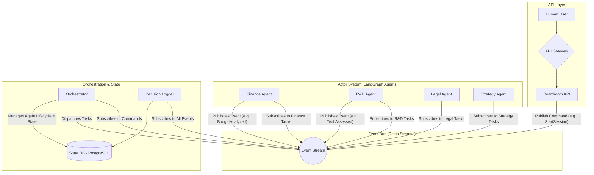

# Professional Assessment of the Multi-Agent Boardroom Project

This assessment covers the project's overall quality, documentation, architecture, and engineering practices, highlighting both strengths and critical areas for improvement.

## 1. Overall Quality & Coherence: B-

The project demonstrates a clear and ambitious vision but suffers from a significant disconnect between its high-level goals and the current technical reality.

* **Positive:** The `README.md` effectively sells a production-ready FastAPI template with a strong feature set, including monitoring, security, and a robust evaluation framework. The `Project_Roadmap.md` clearly articulates the "multi-agent boardroom" concept and its phased development plan.
* **Inconsistency:** A major gap exists between the roadmap's vision and the architecture's capabilities. The `Technical_Analysis.md` correctly identifies that the current design is not viable for the intended scale and complexity. The project is currently more of a "template" than the functional "multi-agent boardroom system" described.
* **Alignment:** There is a commendable level of self-awareness in the `Technical_Analysis.md`, which accurately pinpoints the technical debt and architectural limitations. The analysis aligns with the roadmap's goals by highlighting why the current path will fail to achieve them.

## 2. Documentation Analysis: C+

The documentation is a collection of well-written but disconnected artifacts, lacking a unified narrative and a single source of truth.

* **`README.md`:** Excellent as a generic template guide but fails to describe the project's actual purpose. It needs to be rewritten to reflect the specific domain of the multi-agent boardroom.
* **`Project_Roadmap.md`:** Provides a good business-level overview and a clear development timeline. However, it glosses over the severe technical challenges that are detailed in the technical analysis, presenting an overly optimistic view.
* **`Technical_Analysis.md`:** This is the most valuable and candid document. It provides an accurate, insightful, and technically sound assessment of the project's state, and its recommendations are well-founded.
* **Missing Documentation:** Critical pieces are missing. There is no overarching architectural document, no detailed data schema documentation, no definition of the agent interaction protocol, and no CI/CD strategy.

## 3. Architectural Evaluation: C

The current architecture is fundamentally unfit for its intended purpose. It employs a simple, synchronous request-response model that is ill-suited for a complex, asynchronous, multi-agent system.

* **Scalability:** The `Technical_Analysis.md` is correct. The synchronous, O(n) complexity design is a critical bottleneck that prevents the system from scaling beyond a small number of agents.
* **Maintainability:** The state management logic is overly complex and centralized in `app/core/langgraph/boardroom.py`, creating a single point of failure and a significant maintenance burden.
* **Modularity:** While the file structure suggests modularity, the core components are tightly coupled. The API layer's direct manipulation of the LangGraph state is a clear violation of the separation of concerns principle.
* **Modern Practices:** The use of FastAPI, Docker, and Prometheus is a positive sign. However, the core architectural pattern is outdated for this problem domain. An event-driven architecture is the industry standard for building scalable and resilient distributed systems.

## 4. Engineering & DevOps Gaps

The project lacks several foundational engineering practices required for a production-ready system.

* **Testing Strategy:** The absence of a formal testing strategy (unit, integration, E2E) is a major red flag. The `evals` framework is for model performance, not code quality, which leaves the codebase fragile and makes refactoring risky.
* **CI/CD Pipeline:** The project relies on manual scripts. Without an automated CI/CD pipeline, the deployment process is inefficient, error-prone, and not repeatable.
* **Environment Management:** The use of `.env` files is a start, but there is no robust process for managing secrets or ensuring parity across environments.
* **Security:** While JWT is mentioned, there is no discussion of authorization or role-based access control (RBAC), which will be critical for the planned human-in-the-loop features.
* **Resilience:** The system is brittle. The technical analysis correctly identifies a lack of robust error handling, retry mechanisms, and state recovery capabilities.

## 5. Summary of Technical Debt

The project is carrying significant architectural and implementation debt:

1. **State Management:** The monolithic, in-memory state management is the primary source of debt.
2. **Synchronous Communication:** The agent interaction model is a critical performance and scalability bottleneck.
3. **Lack of Testing:** The absence of a testing culture makes the system difficult to maintain and evolve safely.
4. **Centralized Orchestration:** The `Boardroom Manager` is a bottleneck and a single point of failure.
5. **Inconsistent Documentation:** The documentation is misleading and fails to reflect the project's actual state.

---

# Proposed Strategic Plan & Architectural Redesign

To address these issues and position the project for a successful MVP, I propose a strategic pivot focused on architectural stability and engineering discipline.

## 1. Architectural Redesign: Event-Driven, Actor-Based Model

I recommend replacing the current synchronous architecture with a hybrid approach that combines an event bus (e.g., Redis Streams) with the Actor model.

**Proposed Architecture:**

**Benefits of this Architecture:**

* **Decoupling & Scalability:** Components are decoupled and communicate asynchronously, allowing for horizontal scaling.
* **Resilience:** The event bus provides message persistence, enabling agents to recover from failures.
* **Maintainability:** Logic is decentralized into self-contained actors, making the system easier to understand and maintain.

## 2. Priority Action Plan

**Sprint 1: Foundational Refactoring (2 Weeks)**

* **Goal:** Stabilize the architecture.
* **Tasks:**
    1. **Implement Event Bus:** Integrate Redis Streams and create a central module for event handling.
    2. **Refactor State Management:** Move state to PostgreSQL, implementing snapshotting and versioning.
    3. **Introduce Testing:** Set up `pytest` and write unit/integration tests for the new modules.
    4. **Update Documentation:** Rewrite the `README.md` and create a new `ARCHITECTURE.md` file.

**Sprint 2: Agent Refactoring & CI/CD (2 Weeks)**

* **Goal:** Adapt agents to the new architecture and automate the development lifecycle.
* **Tasks:**
    1. **Refactor Agents:** Convert agents into independent actors that subscribe to the event bus.
    2. **Implement Orchestrator:** Build the orchestrator service to manage the agent lifecycle.
    3. **Set up CI/CD Pipeline:** Create a basic CI/CD pipeline using GitHub Actions.
    4. **Improve Error Handling:** Implement dead-letter queues and robust retry logic.

**Sprint 3: Features & Observability (1 Month)**

* **Goal:** Re-implement core features on the new, stable architecture.
* **Tasks:**
    1. **Re-implement Boardroom Mechanics:** Rebuild core features on the event-driven system.
    2. **Enhance Decision Traceability:** Create an immutable, signed audit trail for all decisions.
    3. **Calibrate Evaluation Framework:** Implement quantitative scoring and a calibration system.
    4. **Expand Monitoring:** Update Grafana dashboards to monitor the new architecture.
