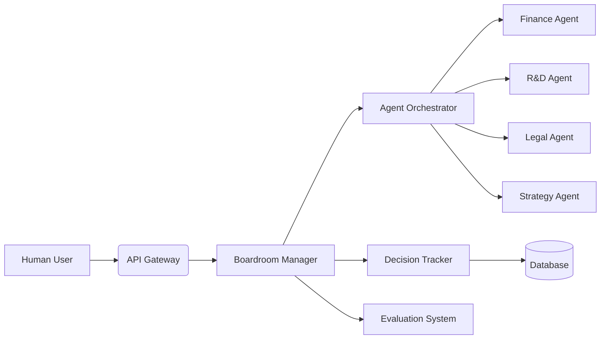

# Project Roadmap: Multi-Agent Boardroom System

## System Overview

Our project creates a virtual boardroom where AI agents collaborate like executives in a corporate meeting. Imagine a digital conference room where:

- Each agent represents a specialized department (Finance, R&D, Legal, etc.)
- Agents debate using real-time data and specialized knowledge
- Decisions are recorded with full audit trails
- Human observers can intervene or guide discussions

### Core Components

## Development Progress

### Phase 1: Foundation Setup (Completed)

1. **Core Infrastructure**
   - Docker environment with PostgreSQL database
   - FastAPI backend framework
   - Authentication system
   - Logging and monitoring (Prometheus/Grafana)

2. **Initial Agent Framework**
   - LangGraph integration for agent orchestration
   - Basic agent communication protocol
   - Simple decision recording system

### Phase 2: Core Functionality (In Progress)

1. **Agent Specialization**
   - Implemented Finance Agent with budget analysis capabilities
   - R&D Agent with technical assessment skills
   - Legal Agent with compliance checking
   - *Status: 80% complete - Strategy Agent pending*

2. **Boardroom Mechanics**
   - Turn-based discussion system
   - Proposal voting mechanism
   - Basic conflict resolution
   - *Status: Implemented but needs stress testing*

3. **Evaluation Framework**
   - Conciseness and relevancy metrics
   - Hallucination detection
   - Toxicity monitoring
   - *Status: Metrics defined, calibration in progress*

### Phase 3: Advanced Features (Next Steps)

1. **Real-time Data Integration**
   - Market data feeds for Finance Agent
   - Patent database for R&D Agent
   - Regulatory updates for Legal Agent

2. **Human-AI Interaction**
   - Observer intervention interface
   - Directive override system
   - Real-time feedback mechanism

3. **Scalability Enhancements**
   - Agent load balancing
   - State snapshotting
   - Priority messaging system

## Current Project Position

We are currently at the **midpoint of Phase 2**. Key accomplishments include:

- Functional boardroom with 3 agent types
- Decision tracking with basic audit trails
- Evaluation system for agent performance
- API endpoints for session management

### Pending Challenges

1. **State Synchronization**  
   Agents occasionally lose context during extended discussions

2. **Decision Explainability**  
   Audit trails show actions but lack reasoning context

3. **Scalability Limits**  
   Performance degrades beyond 5 concurrent agents

## Next Development Steps

### Immediate Priorities (Next 2 Weeks)

1. Complete Strategy Agent implementation
2. Implement state snapshotting for crash recovery
3. Add reasoning capture to decision audit trails
4. Conduct 10-agent stress test

### Medium-Term Goals (Next Month)

1. Integrate real-time data feeds
2. Develop human override interface
3. Implement message prioritization system
4. Create agent performance dashboard

### Long-Term Vision

1. Multi-boardroom simulations
2. Cross-company negotiation scenarios
3. Predictive decision analytics
4. Autonomous strategy formulation

## Key Technical Dependencies

1. LangGraph state management improvements
2. PostgreSQL optimization for session data
3. DuckDuckGo search API reliability
4. Evaluation metric calibration datasets

## Conclusion

Our project stands at a critical juncture where core functionality is operational but requires refinement before scaling. The immediate focus should be on stabilizing agent interactions and improving state management. With these foundations strengthened, we can progress to more complex simulations and real-world applications.

This roadmap will be updated weekly to reflect our progress and adjust priorities as we advance toward a fully functional multi-agent boardroom system.
