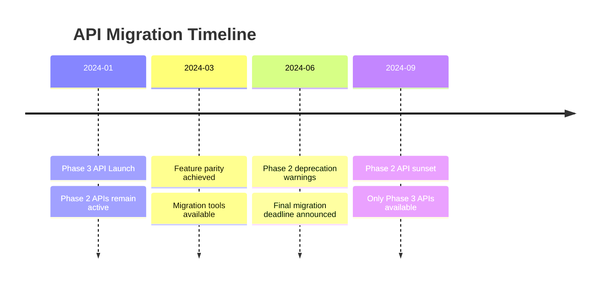

# API Migration Guide - Phase 2 to Phase 3

## Overview

This guide helps developers migrate from Phase 2 APIs to the enhanced Phase 3 APIs. Phase 3 introduces WebSocket support, advanced data management, enhanced security features, and improved performance optimization.

## Key Changes

### 1. WebSocket Integration
- New real-time communication protocol
- Replaces polling-based updates
- Bidirectional event streaming

### 2. Enhanced Security
- Multi-factor authentication (MFA) required for sensitive operations
- Improved session management
- Role-based access control (RBAC)

### 3. Data Management
- Advanced caching strategies
- Offline support
- Import/export capabilities

### 4. API Versioning
- Version moved to URL path: `/api/v1/` → `/api/v3/`
- Backward compatibility maintained for 6 months

## Migration Timeline



## Authentication Changes

### Phase 2 (Old)

```javascript
// Simple JWT authentication
const response = await fetch('/api/v1/auth/login', {
  method: 'POST',
  headers: {
    'Content-Type': 'application/json'
  },
  body: JSON.stringify({
    email: 'user@example.com',
    password: 'password'
  })
})

const { token } = await response.json()
```

### Phase 3 (New)

```javascript
// Enhanced authentication with MFA support
const response = await fetch('/api/v3/security/auth/login', {
  method: 'POST',
  headers: {
    'Content-Type': 'application/json'
  },
  body: JSON.stringify({
    email: 'user@example.com',
    password: 'password',
    deviceInfo: {
      deviceId: getDeviceId(),
      platform: 'web',
      fingerprint: await getDeviceFingerprint()
    }
  })
})

const data = await response.json()

// Handle MFA if required
if (!data.success && data.error.code === 'MFA_REQUIRED') {
  const mfaResponse = await fetch('/api/v3/security/auth/mfa/verify', {
    method: 'POST',
    headers: {
      'Content-Type': 'application/json'
    },
    body: JSON.stringify({
      challengeToken: data.error.details.challengeToken,
      code: await promptForMFACode(),
      method: 'totp'
    })
  })
  
  const mfaData = await mfaResponse.json()
  token = mfaData.data.accessToken
} else {
  token = data.data.accessToken
}
```

## Real-Time Updates Migration

### Phase 2 (Polling)

```javascript
// Polling for meeting updates
let pollInterval

function startPolling(meetingId) {
  pollInterval = setInterval(async () => {
    const response = await fetch(`/api/v1/meetings/${meetingId}`)
    const meeting = await response.json()
    updateMeetingUI(meeting)
  }, 5000) // Poll every 5 seconds
}

function stopPolling() {
  clearInterval(pollInterval)
}
```

### Phase 3 (WebSocket)

```javascript
// WebSocket real-time updates
import { BoardroomWebSocket } from '@boardroom/websocket-client'

const ws = new BoardroomWebSocket({
  url: 'wss://api.boardroom.com/ws',
  token: authToken
})

// Subscribe to meeting updates
ws.subscribe(`meeting:${meetingId}`)

// Receive real-time updates
ws.on('meeting.participant.joined', (data) => {
  updateParticipantsList(data.participant)
})

ws.on('meeting.agenda.update', (data) => {
  updateAgendaProgress(data)
})

// Clean up
ws.unsubscribe(`meeting:${meetingId}`)
ws.disconnect()
```

## Data Operations Migration

### Phase 2 (Basic CRUD)

```javascript
// Create boardroom
const response = await fetch('/api/v1/boardrooms', {
  method: 'POST',
  headers: {
    'Authorization': `Bearer ${token}`,
    'Content-Type': 'application/json'
  },
  body: JSON.stringify({
    name: 'Executive Board',
    description: 'Main boardroom'
  })
})
```

### Phase 3 (Enhanced Data Management)

```javascript
// Create with validation and relationships
const response = await fetch('/api/v3/data/boardroom', {
  method: 'POST',
  headers: {
    'Authorization': `Bearer ${token}`,
    'Content-Type': 'application/json',
    'X-Request-ID': generateRequestId()
  },
  body: JSON.stringify({
    data: {
      type: 'boardroom',
      attributes: {
        name: 'Executive Board',
        description: 'Main boardroom',
        settings: {
          isPublic: false,
          requiresApproval: true
        }
      },
      relationships: {
        owner: {
          data: { type: 'user', id: userId }
        }
      }
    }
  })
})

// Response includes ETag for optimistic locking
const { data, metadata } = await response.json()
const etag = metadata.etag
```

## Search Migration

### Phase 2 (Basic Search)

```javascript
// Simple text search
const response = await fetch('/api/v1/search?q=budget&type=meeting')
const results = await response.json()
```

### Phase 3 (Advanced Search)

```javascript
// Full-text search with facets
const response = await fetch('/api/v3/data/search', {
  method: 'POST',
  headers: {
    'Authorization': `Bearer ${token}`,
    'Content-Type': 'application/json'
  },
  body: JSON.stringify({
    query: 'budget meeting',
    entities: ['boardroom', 'meeting', 'decision'],
    filters: {
      dateRange: {
        start: '2024-01-01T00:00:00Z',
        end: '2024-12-31T23:59:59Z'
      },
      tags: ['finance', 'quarterly']
    },
    facets: ['entity', 'tags', 'author'],
    highlight: {
      fields: ['title', 'description'],
      preTag: '<em>',
      postTag: '</em>'
    },
    pagination: {
      page: 1,
      size: 20
    }
  })
})

const { data } = await response.json()
// Results include facet counts and highlights
```

## Caching Strategy Migration

### Phase 2 (Browser Cache)

```javascript
// Basic cache headers
fetch('/api/v1/boardrooms/123', {
  headers: {
    'Authorization': `Bearer ${token}`,
    'Cache-Control': 'max-age=300'
  }
})
```

### Phase 3 (Advanced Caching)

```javascript
import { DataClient } from '@boardroom/data-sdk'

const client = new DataClient({
  baseUrl: 'https://api.boardroom.com/api/v3',
  token: authToken,
  cache: {
    strategy: 'stale-while-revalidate',
    ttl: 300000, // 5 minutes
    storage: 'indexeddb' // Use IndexedDB for large data
  }
})

// Automatic cache management
const boardroom = await client.get('boardroom', '123', {
  include: ['members', 'meetings'],
  cache: {
    strategy: 'cache-first',
    ttl: 600000 // 10 minutes for this request
  }
})

// Force refresh
const freshData = await client.get('boardroom', '123', {
  cache: { strategy: 'network-only' }
})
```

## Permission Checking Migration

### Phase 2 (Role-based)

```javascript
// Check user role
const hasAccess = user.role === 'admin' || user.role === 'board_member'
```

### Phase 3 (RBAC with Context)

```javascript
// Fine-grained permission checking
const response = await fetch('/api/v3/security/permissions/check', {
  method: 'POST',
  headers: {
    'Authorization': `Bearer ${token}`,
    'Content-Type': 'application/json'
  },
  body: JSON.stringify({
    resource: 'boardroom',
    action: 'create',
    context: {
      organizationId: 'org_123'
    }
  })
})

const { data } = await response.json()
if (data.allowed) {
  // User has permission
  showCreateButton()
}

// Frontend helper
import { usePermissions } from '@boardroom/react-sdk'

function BoardroomControls() {
  const { can } = usePermissions()
  
  return (
    <>
      {can('boardroom', 'create') && <CreateButton />}
      {can('boardroom', 'delete') && <DeleteButton />}
    </>
  )
}
```

## Error Handling Migration

### Phase 2 (Basic Errors)

```javascript
try {
  const response = await fetch('/api/v1/boardrooms')
  if (!response.ok) {
    throw new Error('Request failed')
  }
} catch (error) {
  console.error('Error:', error)
}
```

### Phase 3 (Structured Errors)

```javascript
try {
  const response = await fetch('/api/v3/data/boardroom')
  const data = await response.json()
  
  if (!data.success) {
    // Handle structured error
    switch (data.error.code) {
      case 'VALIDATION_ERROR':
        showValidationErrors(data.error.details)
        break
      case 'PERMISSION_DENIED':
        redirectToLogin()
        break
      case 'RATE_LIMITED':
        const retryAfter = data.error.details.retryAfter
        scheduleRetry(retryAfter)
        break
      default:
        showGenericError(data.error.message)
    }
  }
} catch (error) {
  // Network or parsing error
  handleNetworkError(error)
}
```

## Batch Operations Migration

### Phase 2 (Individual Requests)

```javascript
// Update multiple items
for (const item of items) {
  await fetch(`/api/v1/meetings/${item.id}`, {
    method: 'PATCH',
    headers: {
      'Authorization': `Bearer ${token}`,
      'Content-Type': 'application/json'
    },
    body: JSON.stringify(item.updates)
  })
}
```

### Phase 3 (Batch API)

```javascript
// Batch update
const response = await fetch('/api/v3/data/batch', {
  method: 'POST',
  headers: {
    'Authorization': `Bearer ${token}`,
    'Content-Type': 'application/json'
  },
  body: JSON.stringify({
    operations: items.map(item => ({
      method: 'PATCH',
      path: `/data/meeting/${item.id}`,
      body: {
        data: {
          type: 'meeting',
          id: item.id,
          attributes: item.updates
        }
      }
    }))
  })
})

const { data } = await response.json()
// Results for each operation
data.results.forEach((result, index) => {
  if (!result.success) {
    console.error(`Failed to update ${items[index].id}:`, result.error)
  }
})
```

## Migration Checklist

### Authentication & Security
- [ ] Update login flow to handle MFA
- [ ] Implement device fingerprinting
- [ ] Update session management
- [ ] Migrate to new permission checking

### Real-Time Features
- [ ] Replace polling with WebSocket
- [ ] Implement reconnection logic
- [ ] Add connection status indicators
- [ ] Handle offline scenarios

### Data Management
- [ ] Implement new caching strategies
- [ ] Add offline queue support
- [ ] Update to new data format
- [ ] Implement optimistic updates

### API Calls
- [ ] Update base URL to v3
- [ ] Add required headers
- [ ] Handle new error format
- [ ] Implement request batching

### Testing
- [ ] Update unit tests
- [ ] Add WebSocket tests
- [ ] Test offline scenarios
- [ ] Performance testing

## SDK Migration

### Installing Phase 3 SDK

```bash
# Remove old SDK
npm uninstall @boardroom/api-client

# Install new SDKs
npm install @boardroom/data-sdk @boardroom/websocket-client @boardroom/security-sdk
```

### SDK Initialization

```javascript
// Phase 2
import { BoardroomAPI } from '@boardroom/api-client'

const api = new BoardroomAPI({
  baseUrl: 'https://api.boardroom.com/api/v1',
  token: authToken
})

// Phase 3
import { DataClient } from '@boardroom/data-sdk'
import { SecurityClient } from '@boardroom/security-sdk'
import { BoardroomWebSocket } from '@boardroom/websocket-client'

const dataClient = new DataClient({
  baseUrl: 'https://api.boardroom.com/api/v3',
  token: authToken,
  cache: true
})

const securityClient = new SecurityClient({
  baseUrl: 'https://api.boardroom.com/api/v3',
  token: authToken
})

const wsClient = new BoardroomWebSocket({
  url: 'wss://api.boardroom.com/ws',
  token: authToken,
  reconnect: true
})
```

## Backward Compatibility

### Using Compatibility Mode

```javascript
// Enable compatibility mode for gradual migration
const client = new DataClient({
  baseUrl: 'https://api.boardroom.com/api/v3',
  token: authToken,
  compatibility: {
    mode: 'v2',
    warnings: true // Log deprecation warnings
  }
})

// Old API calls still work but show warnings
const boardrooms = await client.v2.getBoardrooms() // Deprecation warning
```

### Response Transformation

```javascript
// Transform v3 responses to v2 format
function transformResponse(v3Response) {
  return {
    id: v3Response.data.id,
    ...v3Response.data.attributes,
    // Flatten relationships
    members: v3Response.data.relationships?.members?.data || []
  }
}

// Wrapper for gradual migration
class MigrationWrapper {
  async getBoardroom(id) {
    const response = await fetch(`/api/v3/data/boardroom/${id}`)
    const v3Data = await response.json()
    return transformResponse(v3Data)
  }
}
```

## Common Issues and Solutions

### Issue: WebSocket Connection Fails

```javascript
// Solution: Implement fallback to polling
class RealtimeService {
  constructor() {
    this.wsSupported = 'WebSocket' in window
    this.fallbackToPulling = false
  }
  
  async connect() {
    if (this.wsSupported && !this.fallbackToPulling) {
      try {
        await this.connectWebSocket()
      } catch (error) {
        console.warn('WebSocket failed, falling back to polling')
        this.fallbackToPulling = true
        this.startPolling()
      }
    } else {
      this.startPolling()
    }
  }
}
```

### Issue: Cache Conflicts

```javascript
// Solution: Clear old cache during migration
async function migrateCacheStorage() {
  // Clear old cache
  if ('caches' in window) {
    const cacheNames = await caches.keys()
    await Promise.all(
      cacheNames
        .filter(name => name.startsWith('boardroom-v2'))
        .map(name => caches.delete(name))
    )
  }
  
  // Clear localStorage
  Object.keys(localStorage)
    .filter(key => key.startsWith('boardroom_'))
    .forEach(key => localStorage.removeItem(key))
}
```

### Issue: Permission Errors

```javascript
// Solution: Refresh permissions on 403
class PermissionManager {
  async checkPermission(resource, action) {
    try {
      return await this.securityClient.checkPermission({ resource, action })
    } catch (error) {
      if (error.code === 'PERMISSION_DENIED') {
        // Refresh user permissions
        await this.refreshUserPermissions()
        // Retry once
        return await this.securityClient.checkPermission({ resource, action })
      }
      throw error
    }
  }
}
```

## Support Resources

### Documentation
- [Phase 3 API Reference](/api/v3/docs)
- [WebSocket API Guide](./websocket-api.md)
- [Security API Guide](./security-api.md)
- [Data API Guide](./data-api.md)

### Tools
- [API Migration Tool](https://tools.boardroom.com/migrate)
- [Compatibility Checker](https://tools.boardroom.com/compatibility)
- [Performance Analyzer](https://tools.boardroom.com/performance)

### Support
- Developer Forum: https://forum.boardroom.com
- Support Email: api-support@boardroom.com
- Migration Hotline: +1-800-BOARDROOM

## Timeline and Deprecation

| Date | Milestone |
|------|-----------|
| 2024-01-15 | Phase 3 API Launch |
| 2024-03-01 | Migration tools available |
| 2024-06-01 | Deprecation warnings begin |
| 2024-07-01 | New features only in v3 |
| 2024-09-01 | Phase 2 API sunset |

---

For questions or assistance with migration, please contact our support team or refer to the [Phase 3 Documentation](../README.md).