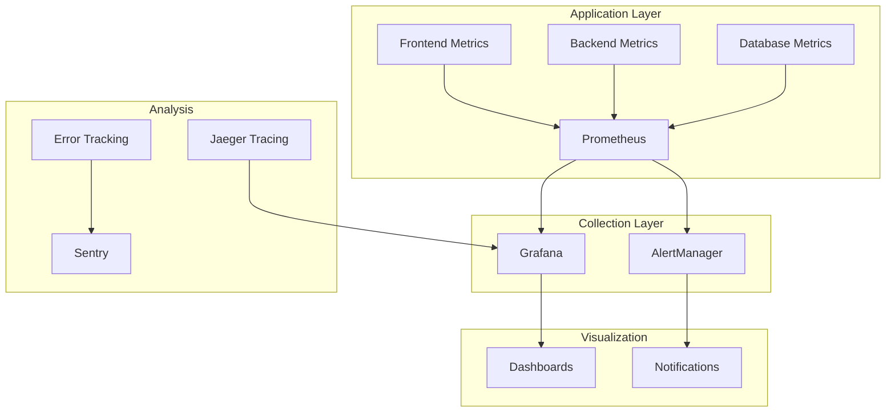

# Performance Monitoring Guide

## Overview

This guide provides comprehensive instructions for monitoring, analyzing, and optimizing the performance of the Boardroom Phase 3 platform. It covers frontend and backend monitoring, metrics collection, analysis tools, and performance optimization strategies.

## Performance Monitoring Stack



## Frontend Performance Monitoring

### Core Web Vitals

```typescript
// utils/performance-monitor.ts
export class PerformanceMonitor {
  private metrics: Map<string, number> = new Map()
  
  constructor() {
    if (typeof window !== 'undefined') {
      this.initializeObservers()
    }
  }
  
  private initializeObservers() {
    // Largest Contentful Paint (LCP)
    new PerformanceObserver((list) => {
      const entries = list.getEntries()
      const lastEntry = entries[entries.length - 1]
      this.metrics.set('lcp', lastEntry.renderTime || lastEntry.loadTime)
      this.reportMetric('lcp', lastEntry.renderTime || lastEntry.loadTime)
    }).observe({ entryTypes: ['largest-contentful-paint'] })
    
    // First Input Delay (FID)
    new PerformanceObserver((list) => {
      list.getEntries().forEach((entry) => {
        this.metrics.set('fid', entry.processingStart - entry.startTime)
        this.reportMetric('fid', entry.processingStart - entry.startTime)
      })
    }).observe({ entryTypes: ['first-input'] })
    
    // Cumulative Layout Shift (CLS)
    let clsValue = 0
    let clsEntries = []
    
    new PerformanceObserver((list) => {
      list.getEntries().forEach((entry) => {
        if (!entry.hadRecentInput) {
          clsValue += entry.value
          clsEntries.push(entry)
        }
      })
      this.metrics.set('cls', clsValue)
      this.reportMetric('cls', clsValue)
    }).observe({ entryTypes: ['layout-shift'] })
    
    // Time to First Byte (TTFB)
    new PerformanceObserver((list) => {
      list.getEntries().forEach((entry) => {
        const ttfb = entry.responseStart - entry.requestStart
        this.metrics.set('ttfb', ttfb)
        this.reportMetric('ttfb', ttfb)
      })
    }).observe({ entryTypes: ['navigation'] })
  }
  
  private reportMetric(name: string, value: number) {
    // Send to analytics
    if (window.gtag) {
      window.gtag('event', name, {
        value: Math.round(name === 'cls' ? value * 1000 : value),
        metric_id: `web_vitals_${name}`,
        metric_value: value,
        metric_delta: value
      })
    }
    
    // Send to custom monitoring endpoint
    fetch('/api/v1/metrics', {
      method: 'POST',
      headers: { 'Content-Type': 'application/json' },
      body: JSON.stringify({
        metric: name,
        value: value,
        timestamp: new Date().toISOString(),
        url: window.location.href,
        userAgent: navigator.userAgent
      })
    }).catch(console.error)
  }
  
  getMetrics(): Record<string, number> {
    return Object.fromEntries(this.metrics)
  }
}

// Initialize on app load
export const perfMonitor = new PerformanceMonitor()
```

### React Performance Profiling

```typescript
// components/PerformanceProfiler.tsx
import { Profiler, ProfilerOnRenderCallback } from 'react'

const onRenderCallback: ProfilerOnRenderCallback = (
  id, // the "id" prop of the Profiler tree that has just committed
  phase, // either "mount" (if the tree just mounted) or "update" (if it re-rendered)
  actualDuration, // time spent rendering the committed update
  baseDuration, // estimated time to render the entire subtree without memoization
  startTime, // when React began rendering this update
  commitTime, // when React committed this update
  interactions // the Set of interactions belonging to this update
) => {
  // Log performance data
  if (actualDuration > 16) { // Longer than one frame (60fps)
    console.warn(`Slow render detected in ${id}:`, {
      phase,
      actualDuration,
      baseDuration,
      startTime,
      commitTime
    })
    
    // Send to monitoring
    fetch('/api/v1/metrics/react', {
      method: 'POST',
      headers: { 'Content-Type': 'application/json' },
      body: JSON.stringify({
        componentId: id,
        phase,
        duration: actualDuration,
        timestamp: new Date().toISOString()
      })
    })
  }
}

export const PerformanceProfiler: React.FC<{
  id: string
  children: React.ReactNode
}> = ({ id, children }) => {
  return (
    <Profiler id={id} onRender={onRenderCallback}>
      {children}
    </Profiler>
  )
}

// Usage
<PerformanceProfiler id="BoardroomList">
  <BoardroomList items={boardrooms} />
</PerformanceProfiler>
```

### Bundle Size Monitoring

```javascript
// scripts/bundle-analyzer.js
const webpack = require('webpack')
const { BundleAnalyzerPlugin } = require('webpack-bundle-analyzer')
const nextConfig = require('../next.config.js')

// Custom webpack config for analysis
const config = {
  ...nextConfig.webpack,
  plugins: [
    new BundleAnalyzerPlugin({
      analyzerMode: 'static',
      reportFilename: 'bundle-analysis.html',
      openAnalyzer: false,
      generateStatsFile: true,
      statsFilename: 'bundle-stats.json'
    })
  ]
}

// Analyze and report
webpack(config, (err, stats) => {
  if (err) throw err
  
  const info = stats.toJson()
  const assets = info.assets
    .filter(asset => asset.name.endsWith('.js'))
    .sort((a, b) => b.size - a.size)
  
  console.log('\n📦 Bundle Size Report:')
  console.log('====================')
  
  let totalSize = 0
  assets.forEach(asset => {
    const sizeInKB = (asset.size / 1024).toFixed(2)
    console.log(`${asset.name}: ${sizeInKB} KB`)
    totalSize += asset.size
  })
  
  console.log('--------------------')
  console.log(`Total: ${(totalSize / 1024 / 1024).toFixed(2)} MB`)
  
  // Check against budgets
  const budgets = {
    'main.js': 250 * 1024, // 250KB
    'vendor.js': 500 * 1024, // 500KB
    total: 1024 * 1024 // 1MB
  }
  
  let budgetViolations = []
  assets.forEach(asset => {
    if (budgets[asset.name] && asset.size > budgets[asset.name]) {
      budgetViolations.push({
        file: asset.name,
        size: asset.size,
        budget: budgets[asset.name],
        overBy: ((asset.size - budgets[asset.name]) / 1024).toFixed(2)
      })
    }
  })
  
  if (budgetViolations.length > 0) {
    console.error('\n❌ Budget Violations:')
    budgetViolations.forEach(violation => {
      console.error(`${violation.file} is ${violation.overBy}KB over budget`)
    })
    process.exit(1)
  } else {
    console.log('\n✅ All bundles within budget!')
  }
})
```

### Client-Side Monitoring

```typescript
// hooks/usePerformanceTracking.ts
import { useEffect, useRef } from 'react'
import { useRouter } from 'next/router'

export const usePerformanceTracking = () => {
  const router = useRouter()
  const startTime = useRef<number>()
  
  useEffect(() => {
    const handleRouteChangeStart = () => {
      startTime.current = performance.now()
    }
    
    const handleRouteChangeComplete = (url: string) => {
      if (startTime.current) {
        const duration = performance.now() - startTime.current
        
        // Track route change performance
        window.gtag?.('event', 'page_transition', {
          event_category: 'performance',
          value: Math.round(duration),
          page_path: url
        })
        
        // Log slow transitions
        if (duration > 1000) {
          console.warn(`Slow page transition to ${url}: ${duration}ms`)
        }
      }
    }
    
    router.events.on('routeChangeStart', handleRouteChangeStart)
    router.events.on('routeChangeComplete', handleRouteChangeComplete)
    
    return () => {
      router.events.off('routeChangeStart', handleRouteChangeStart)
      router.events.off('routeChangeComplete', handleRouteChangeComplete)
    }
  }, [router])
}

// Memory leak detection
export const useMemoryMonitoring = () => {
  useEffect(() => {
    if (!performance.memory) return
    
    const checkMemory = () => {
      const memoryInfo = performance.memory
      const usedMemoryMB = memoryInfo.usedJSHeapSize / 1024 / 1024
      const limitMB = memoryInfo.jsHeapSizeLimit / 1024 / 1024
      
      if (usedMemoryMB > limitMB * 0.9) {
        console.error('⚠️ High memory usage detected:', {
          used: `${usedMemoryMB.toFixed(2)} MB`,
          limit: `${limitMB.toFixed(2)} MB`,
          percentage: `${((usedMemoryMB / limitMB) * 100).toFixed(2)}%`
        })
        
        // Send alert
        fetch('/api/v1/alerts', {
          method: 'POST',
          headers: { 'Content-Type': 'application/json' },
          body: JSON.stringify({
            type: 'high_memory_usage',
            data: {
              usedMemoryMB,
              limitMB,
              url: window.location.href
            }
          })
        })
      }
    }
    
    const interval = setInterval(checkMemory, 30000) // Check every 30s
    return () => clearInterval(interval)
  }, [])
}
```

## Backend Performance Monitoring

### FastAPI Metrics Integration

```python
# app/core/metrics.py
from prometheus_client import Counter, Histogram, Gauge, generate_latest
from prometheus_client.core import CollectorRegistry
from fastapi import FastAPI, Request, Response
from typing import Callable
import time
import psutil
import asyncio

# Create metrics
registry = CollectorRegistry()

request_count = Counter(
    'http_requests_total',
    'Total HTTP requests',
    ['method', 'endpoint', 'status'],
    registry=registry
)

request_duration = Histogram(
    'http_request_duration_seconds',
    'HTTP request duration',
    ['method', 'endpoint'],
    registry=registry
)

active_requests = Gauge(
    'http_requests_active',
    'Active HTTP requests',
    registry=registry
)

db_connections = Gauge(
    'db_connections_active',
    'Active database connections',
    registry=registry
)

cache_hits = Counter(
    'cache_hits_total',
    'Total cache hits',
    ['cache_type'],
    registry=registry
)

cache_misses = Counter(
    'cache_misses_total',
    'Total cache misses',
    ['cache_type'],
    registry=registry
)

# System metrics
cpu_usage = Gauge(
    'system_cpu_usage_percent',
    'CPU usage percentage',
    registry=registry
)

memory_usage = Gauge(
    'system_memory_usage_bytes',
    'Memory usage in bytes',
    registry=registry
)

def setup_metrics(app: FastAPI):
    """Setup Prometheus metrics for FastAPI"""
    
    @app.middleware("http")
    async def track_metrics(request: Request, call_next: Callable):
        # Skip metrics endpoint
        if request.url.path == "/metrics":
            return await call_next(request)
        
        # Track active requests
        active_requests.inc()
        
        # Track request duration
        start_time = time.time()
        
        try:
            response = await call_next(request)
            status = response.status_code
        except Exception as e:
            status = 500
            raise
        finally:
            duration = time.time() - start_time
            
            # Record metrics
            labels = {
                'method': request.method,
                'endpoint': request.url.path,
                'status': str(status)
            }
            request_count.labels(**labels).inc()
            request_duration.labels(
                method=request.method,
                endpoint=request.url.path
            ).observe(duration)
            
            active_requests.dec()
        
        return response
    
    @app.get("/metrics", include_in_schema=False)
    async def metrics():
        """Prometheus metrics endpoint"""
        # Update system metrics
        cpu_usage.set(psutil.cpu_percent())
        memory_usage.set(psutil.Process().memory_info().rss)
        
        return Response(
            generate_latest(registry),
            media_type="text/plain"
        )
    
    # Background task to update system metrics
    async def update_system_metrics():
        while True:
            cpu_usage.set(psutil.cpu_percent(interval=1))
            memory_usage.set(psutil.Process().memory_info().rss)
            await asyncio.sleep(10)
    
    @app.on_event("startup")
    async def start_background_tasks():
        asyncio.create_task(update_system_metrics())
```

### Database Performance Monitoring

```python
# app/core/db_monitoring.py
from sqlalchemy import event
from sqlalchemy.engine import Engine
from sqlalchemy.pool import Pool
import logging
import time
from contextvars import ContextVar

# Context variable for request tracking
request_id_var = ContextVar('request_id', default=None)

logger = logging.getLogger(__name__)

class DatabaseMonitor:
    def __init__(self):
        self.slow_query_threshold = 1.0  # 1 second
        self.query_times = []
    
    def setup(self, engine: Engine):
        """Setup database monitoring"""
        
        # Monitor connection pool
        @event.listens_for(Pool, "connect")
        def on_connect(dbapi_conn, connection_record):
            connection_record.info['connect_time'] = time.time()
            db_connections.inc()
        
        @event.listens_for(Pool, "close")
        def on_close(dbapi_conn, connection_record):
            db_connections.dec()
        
        # Monitor queries
        @event.listens_for(Engine, "before_cursor_execute")
        def before_cursor_execute(conn, cursor, statement, parameters, context, executemany):
            conn.info.setdefault('query_start_time', []).append(time.time())
            logger.debug(f"Start Query: {statement[:100]}...")
        
        @event.listens_for(Engine, "after_cursor_execute")
        def after_cursor_execute(conn, cursor, statement, parameters, context, executemany):
            total = time.time() - conn.info['query_start_time'].pop(-1)
            request_id = request_id_var.get()
            
            # Record query time
            self.query_times.append(total)
            if len(self.query_times) > 1000:
                self.query_times.pop(0)
            
            # Log slow queries
            if total > self.slow_query_threshold:
                logger.warning(
                    f"Slow query detected",
                    extra={
                        'request_id': request_id,
                        'duration': total,
                        'statement': statement[:500],
                        'parameters': str(parameters)[:200]
                    }
                )
                
                # Send to monitoring
                slow_queries.labels(
                    query_type=statement.split()[0].upper()
                ).inc()
        
        @event.listens_for(Engine, "handle_error")
        def handle_error(exception_context):
            logger.error(
                "Database error occurred",
                extra={
                    'request_id': request_id_var.get(),
                    'statement': str(exception_context.statement)[:500],
                    'error': str(exception_context.original_exception)
                }
            )
            db_errors.labels(
                error_type=type(exception_context.original_exception).__name__
            ).inc()

# Usage
db_monitor = DatabaseMonitor()
db_monitor.setup(engine)
```

### API Endpoint Monitoring

```python
# app/api/v1/monitoring.py
from fastapi import APIRouter, Depends, Query
from typing import List, Optional
from datetime import datetime, timedelta
import numpy as np

router = APIRouter(prefix="/monitoring", tags=["monitoring"])

@router.get("/performance/summary")
async def get_performance_summary(
    hours: int = Query(24, description="Hours to look back")
):
    """Get performance summary for the last N hours"""
    
    # Calculate metrics
    end_time = datetime.utcnow()
    start_time = end_time - timedelta(hours=hours)
    
    # Query metrics from your storage (Redis, TimescaleDB, etc.)
    metrics = await get_metrics_for_period(start_time, end_time)
    
    return {
        "period": {
            "start": start_time.isoformat(),
            "end": end_time.isoformat()
        },
        "requests": {
            "total": metrics['total_requests'],
            "success_rate": metrics['success_rate'],
            "error_rate": metrics['error_rate']
        },
        "performance": {
            "avg_response_time": metrics['avg_response_time'],
            "p50_response_time": metrics['p50_response_time'],
            "p95_response_time": metrics['p95_response_time'],
            "p99_response_time": metrics['p99_response_time']
        },
        "throughput": {
            "requests_per_second": metrics['rps'],
            "peak_rps": metrics['peak_rps']
        },
        "errors": {
            "total": metrics['total_errors'],
            "by_type": metrics['errors_by_type']
        }
    }

@router.get("/performance/endpoints")
async def get_endpoint_performance():
    """Get performance metrics by endpoint"""
    
    # Get endpoint metrics
    endpoint_metrics = await get_endpoint_metrics()
    
    # Sort by slowest endpoints
    slowest = sorted(
        endpoint_metrics.items(),
        key=lambda x: x[1]['p95_response_time'],
        reverse=True
    )[:10]
    
    return {
        "slowest_endpoints": [
            {
                "endpoint": endpoint,
                "method": metrics['method'],
                "avg_response_time": metrics['avg_response_time'],
                "p95_response_time": metrics['p95_response_time'],
                "request_count": metrics['count'],
                "error_rate": metrics['error_rate']
            }
            for endpoint, metrics in slowest
        ],
        "most_called": sorted(
            endpoint_metrics.items(),
            key=lambda x: x[1]['count'],
            reverse=True
        )[:10]
    }

@router.get("/health/detailed")
async def detailed_health_check():
    """Detailed health check with component status"""
    
    checks = {}
    
    # Database check
    try:
        start = time.time()
        await db.execute("SELECT 1")
        checks['database'] = {
            'status': 'healthy',
            'response_time': time.time() - start
        }
    except Exception as e:
        checks['database'] = {
            'status': 'unhealthy',
            'error': str(e)
        }
    
    # Redis check
    try:
        start = time.time()
        await redis.ping()
        checks['redis'] = {
            'status': 'healthy',
            'response_time': time.time() - start
        }
    except Exception as e:
        checks['redis'] = {
            'status': 'unhealthy',
            'error': str(e)
        }
    
    # WebSocket check
    ws_connections = get_active_ws_connections()
    checks['websocket'] = {
        'status': 'healthy',
        'active_connections': ws_connections
    }
    
    # Overall status
    overall_status = 'healthy' if all(
        check.get('status') == 'healthy' 
        for check in checks.values()
    ) else 'degraded'
    
    return {
        'status': overall_status,
        'timestamp': datetime.utcnow().isoformat(),
        'checks': checks,
        'metrics': {
            'uptime': get_uptime(),
            'memory_usage_mb': psutil.Process().memory_info().rss / 1024 / 1024,
            'cpu_usage_percent': psutil.cpu_percent()
        }
    }
```

## Grafana Dashboards

### Application Dashboard JSON

```json
{
  "dashboard": {
    "title": "Boardroom Application Metrics",
    "panels": [
      {
        "title": "Request Rate",
        "targets": [
          {
            "expr": "sum(rate(http_requests_total[5m])) by (method)"
          }
        ],
        "type": "graph",
        "gridPos": { "h": 8, "w": 12, "x": 0, "y": 0 }
      },
      {
        "title": "Response Time (p95)",
        "targets": [
          {
            "expr": "histogram_quantile(0.95, sum(rate(http_request_duration_seconds_bucket[5m])) by (le, endpoint))"
          }
        ],
        "type": "graph",
        "gridPos": { "h": 8, "w": 12, "x": 12, "y": 0 }
      },
      {
        "title": "Error Rate",
        "targets": [
          {
            "expr": "sum(rate(http_requests_total{status=~\"5..\"}[5m])) / sum(rate(http_requests_total[5m]))"
          }
        ],
        "type": "singlestat",
        "gridPos": { "h": 4, "w": 6, "x": 0, "y": 8 }
      },
      {
        "title": "Active Connections",
        "targets": [
          {
            "expr": "sum(websocket_connections_active)"
          }
        ],
        "type": "singlestat",
        "gridPos": { "h": 4, "w": 6, "x": 6, "y": 8 }
      },
      {
        "title": "Cache Hit Rate",
        "targets": [
          {
            "expr": "sum(rate(cache_hits_total[5m])) / (sum(rate(cache_hits_total[5m])) + sum(rate(cache_misses_total[5m])))"
          }
        ],
        "type": "gauge",
        "gridPos": { "h": 4, "w": 6, "x": 12, "y": 8 }
      },
      {
        "title": "Database Query Time",
        "targets": [
          {
            "expr": "histogram_quantile(0.95, sum(rate(db_query_duration_seconds_bucket[5m])) by (le))"
          }
        ],
        "type": "graph",
        "gridPos": { "h": 8, "w": 12, "x": 0, "y": 12 }
      }
    ]
  }
}
```

### Custom Alerts

```yaml
# alerts/performance.yml
groups:
  - name: performance
    interval: 30s
    rules:
      - alert: HighResponseTime
        expr: |
          histogram_quantile(0.95,
            sum(rate(http_request_duration_seconds_bucket[5m])) by (le)
          ) > 2
        for: 5m
        labels:
          severity: warning
          team: backend
        annotations:
          summary: "High response time detected"
          description: "95th percentile response time is {{ $value }}s"
          runbook_url: "https://wiki.boardroom.com/runbooks/high-response-time"
      
      - alert: HighErrorRate
        expr: |
          sum(rate(http_requests_total{status=~"5.."}[5m])) 
          / 
          sum(rate(http_requests_total[5m])) > 0.05
        for: 5m
        labels:
          severity: critical
          team: backend
        annotations:
          summary: "High error rate detected"
          description: "Error rate is {{ $value | humanizePercentage }}"
      
      - alert: DatabaseSlowQueries
        expr: |
          rate(slow_queries_total[5m]) > 0.1
        for: 10m
        labels:
          severity: warning
          team: database
        annotations:
          summary: "Database slow queries detected"
          description: "{{ $value }} slow queries per second"
      
      - alert: HighMemoryUsage
        expr: |
          system_memory_usage_bytes / 1024 / 1024 / 1024 > 7
        for: 10m
        labels:
          severity: warning
          team: devops
        annotations:
          summary: "High memory usage"
          description: "Process using {{ $value }}GB of memory"
```

## Performance Testing

### Load Testing with Locust

```python
# performance_tests/locustfile.py
from locust import HttpUser, task, between
import random
import json

class BoardroomUser(HttpUser):
    wait_time = between(1, 3)
    
    def on_start(self):
        """Login and get auth token"""
        response = self.client.post("/api/v1/auth/login", json={
            "email": f"perftest{random.randint(1, 100)}@example.com",
            "password": "password123"
        })
        if response.status_code == 200:
            self.token = response.json()["access_token"]
            self.headers = {"Authorization": f"Bearer {self.token}"}
        else:
            self.headers = {}
    
    @task(5)
    def list_boardrooms(self):
        """List boardrooms - most common operation"""
        with self.client.get(
            "/api/v1/boardrooms",
            headers=self.headers,
            catch_response=True
        ) as response:
            if response.elapsed.total_seconds() > 1:
                response.failure(f"Request took too long: {response.elapsed.total_seconds()}s")
    
    @task(3)
    def view_boardroom(self):
        """View specific boardroom"""
        boardroom_id = random.choice(["1", "2", "3", "4", "5"])
        self.client.get(
            f"/api/v1/boardrooms/{boardroom_id}",
            headers=self.headers,
            name="/api/v1/boardrooms/[id]"
        )
    
    @task(2)
    def create_meeting(self):
        """Create a new meeting"""
        self.client.post(
            "/api/v1/meetings",
            headers=self.headers,
            json={
                "boardroomId": "1",
                "title": f"Performance Test Meeting {random.randint(1, 1000)}",
                "scheduledAt": "2024-12-31T14:00:00Z",
                "duration": 60
            }
        )
    
    @task(1)
    def websocket_test(self):
        """Test WebSocket connection"""
        import websocket
        
        ws_url = self.host.replace("http", "ws") + f"/ws?token={self.token}"
        ws = websocket.create_connection(ws_url)
        
        # Send a ping
        ws.send(json.dumps({"type": "ping"}))
        
        # Wait for pong
        response = ws.recv()
        
        ws.close()

# Run with: locust -f locustfile.py --host=http://localhost:8000
```

### Frontend Performance Testing

```typescript
// performance_tests/lighthouse.ts
import lighthouse from 'lighthouse'
import * as chromeLauncher from 'chrome-launcher'
import fs from 'fs'

async function runLighthouse(url: string) {
  const chrome = await chromeLauncher.launch({ chromeFlags: ['--headless'] })
  
  const options = {
    logLevel: 'info',
    output: 'json',
    onlyCategories: ['performance'],
    port: chrome.port
  }
  
  const runnerResult = await lighthouse(url, options)
  
  // Kill Chrome
  await chrome.kill()
  
  return runnerResult
}

async function testPerformance() {
  const urls = [
    'http://localhost:3000',
    'http://localhost:3000/dashboard',
    'http://localhost:3000/meetings',
    'http://localhost:3000/boardrooms'
  ]
  
  const results = []
  
  for (const url of urls) {
    console.log(`Testing ${url}...`)
    const result = await runLighthouse(url)
    
    const { lhr } = result
    const performanceScore = lhr.categories.performance.score * 100
    
    results.push({
      url,
      score: performanceScore,
      metrics: {
        FCP: lhr.audits['first-contentful-paint'].numericValue,
        LCP: lhr.audits['largest-contentful-paint'].numericValue,
        TTI: lhr.audits['interactive'].numericValue,
        TBT: lhr.audits['total-blocking-time'].numericValue,
        CLS: lhr.audits['cumulative-layout-shift'].numericValue
      }
    })
    
    // Check against budgets
    if (performanceScore < 90) {
      console.error(`❌ ${url} scored ${performanceScore}/100`)
    } else {
      console.log(`✅ ${url} scored ${performanceScore}/100`)
    }
  }
  
  // Save results
  fs.writeFileSync(
    'performance-results.json',
    JSON.stringify(results, null, 2)
  )
  
  // Generate report
  console.log('\n📊 Performance Report:')
  console.log('====================')
  results.forEach(result => {
    console.log(`\n${result.url}`)
    console.log(`Score: ${result.score}/100`)
    console.log(`FCP: ${result.metrics.FCP}ms`)
    console.log(`LCP: ${result.metrics.LCP}ms`)
    console.log(`TTI: ${result.metrics.TTI}ms`)
  })
}

testPerformance().catch(console.error)
```

## Real User Monitoring (RUM)

### Client-Side RUM Implementation

```typescript
// utils/rum.ts
interface RUMConfig {
  apiEndpoint: string
  sampleRate: number
  userId?: string
}

class RealUserMonitoring {
  private config: RUMConfig
  private sessionId: string
  private events: any[] = []
  
  constructor(config: RUMConfig) {
    this.config = config
    this.sessionId = this.generateSessionId()
    this.initializeListeners()
  }
  
  private initializeListeners() {
    // Page visibility changes
    document.addEventListener('visibilitychange', () => {
      this.track('visibility_change', {
        hidden: document.hidden,
        timestamp: Date.now()
      })
    })
    
    // User interactions
    ['click', 'keydown', 'scroll'].forEach(eventType => {
      document.addEventListener(eventType, (event) => {
        if (Math.random() < this.config.sampleRate) {
          this.track('user_interaction', {
            type: eventType,
            target: (event.target as HTMLElement).tagName,
            timestamp: Date.now()
          })
        }
      })
    })
    
    // Resource timing
    new PerformanceObserver((list) => {
      list.getEntries().forEach((entry) => {
        if (entry.entryType === 'resource') {
          this.track('resource_timing', {
            name: entry.name,
            duration: entry.duration,
            size: (entry as any).transferSize || 0,
            type: (entry as any).initiatorType
          })
        }
      })
    }).observe({ entryTypes: ['resource'] })
    
    // JavaScript errors
    window.addEventListener('error', (event) => {
      this.track('js_error', {
        message: event.message,
        source: event.filename,
        line: event.lineno,
        column: event.colno,
        stack: event.error?.stack
      })
    })
    
    // Send data on page unload
    window.addEventListener('beforeunload', () => {
      this.flush()
    })
  }
  
  track(eventType: string, data: any) {
    const event = {
      type: eventType,
      sessionId: this.sessionId,
      userId: this.config.userId,
      timestamp: Date.now(),
      url: window.location.href,
      userAgent: navigator.userAgent,
      data
    }
    
    this.events.push(event)
    
    // Batch send every 10 events or 30 seconds
    if (this.events.length >= 10) {
      this.flush()
    }
  }
  
  private flush() {
    if (this.events.length === 0) return
    
    const events = [...this.events]
    this.events = []
    
    // Use sendBeacon for reliability
    if (navigator.sendBeacon) {
      navigator.sendBeacon(
        this.config.apiEndpoint,
        JSON.stringify({ events })
      )
    } else {
      // Fallback to fetch
      fetch(this.config.apiEndpoint, {
        method: 'POST',
        headers: { 'Content-Type': 'application/json' },
        body: JSON.stringify({ events })
      }).catch(console.error)
    }
  }
  
  private generateSessionId(): string {
    return `${Date.now()}-${Math.random().toString(36).substr(2, 9)}`
  }
}

// Initialize RUM
export const rum = new RealUserMonitoring({
  apiEndpoint: '/api/v1/rum',
  sampleRate: 0.1, // Sample 10% of users
  userId: getUserId()
})
```

## Performance Optimization Checklist

### Frontend Optimization

- [ ] **Bundle Size**
  - [ ] Code splitting implemented
  - [ ] Tree shaking enabled
  - [ ] Unused dependencies removed
  - [ ] Dynamic imports for heavy components

- [ ] **Loading Performance**
  - [ ] Critical CSS inlined
  - [ ] Fonts preloaded
  - [ ] Images optimized and lazy loaded
  - [ ] Service worker caching

- [ ] **Runtime Performance**
  - [ ] React components memoized
  - [ ] Virtual scrolling for long lists
  - [ ] Debounced search/filter inputs
  - [ ] Web Workers for heavy computations

### Backend Optimization

- [ ] **Database**
  - [ ] Indexes on frequently queried columns
  - [ ] Query optimization (N+1 prevention)
  - [ ] Connection pooling configured
  - [ ] Read replicas for heavy reads

- [ ] **Caching**
  - [ ] Redis caching implemented
  - [ ] HTTP caching headers set
  - [ ] Query result caching
  - [ ] Static asset caching

- [ ] **API Performance**
  - [ ] Response compression enabled
  - [ ] Pagination implemented
  - [ ] Field filtering available
  - [ ] Rate limiting configured

### Infrastructure Optimization

- [ ] **Scaling**
  - [ ] Horizontal scaling configured
  - [ ] Load balancing setup
  - [ ] Auto-scaling policies
  - [ ] CDN for static assets

- [ ] **Monitoring**
  - [ ] APM tools configured
  - [ ] Custom metrics tracked
  - [ ] Alerts configured
  - [ ] Dashboards created

## Performance Budgets

### Setting Performance Budgets

```javascript
// performance-budget.js
module.exports = {
  budgets: [
    {
      // Page load metrics
      metrics: {
        'first-contentful-paint': 1500,
        'largest-contentful-paint': 2500,
        'first-input-delay': 100,
        'cumulative-layout-shift': 0.1,
        'total-blocking-time': 300
      }
    },
    {
      // Resource budgets
      resourceSizes: {
        script: 300000, // 300KB for JS
        style: 100000,  // 100KB for CSS
        image: 500000,  // 500KB for images
        font: 100000,   // 100KB for fonts
        total: 1000000  // 1MB total
      }
    },
    {
      // Resource counts
      resourceCounts: {
        script: 10,
        style: 5,
        image: 20,
        font: 5,
        total: 50
      }
    }
  ]
}
```

---

Remember: Performance is not a one-time fix but an ongoing process. Regular monitoring and optimization are key to maintaining a fast, responsive application.