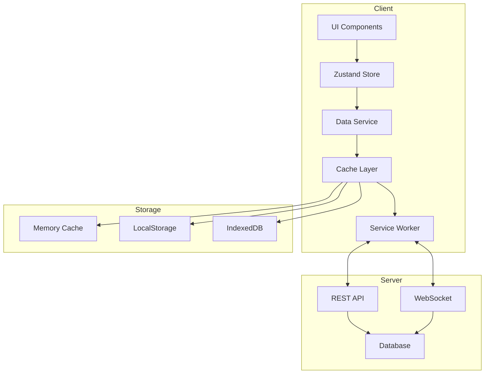

# Advanced Data Management System

## Overview

The Boardroom data management system provides a comprehensive solution for handling application data with advanced features including offline support, state synchronization, caching strategies, and data validation. This system ensures data integrity, optimal performance, and excellent user experience across all scenarios.

## Architecture

### System Overview



### Core Components

1. **State Management** (Zustand)
   - Centralized state store
   - Persistence middleware
   - Cross-tab synchronization
   - Undo/redo functionality

2. **Data Service Layer**
   - Caching strategies
   - Offline queue management
   - Data validation
   - Search indexing

3. **Service Worker**
   - Offline functionality
   - Background sync
   - Cache management
   - Request interception

4. **Storage Layers**
   - Memory cache (fastest)
   - LocalStorage (persistent)
   - IndexedDB (large data)

## State Management

### Zustand Store Configuration

```typescript
// Enhanced Boardroom Store
interface BoardroomState {
  // State
  boardrooms: Boardroom[]
  selectedBoardroom: Boardroom | null
  searchQuery: string
  filters: FilterOptions
  offlineQueue: OfflineAction[]
  syncStatus: SyncStatus
  
  // Actions
  setBoardrooms: (boardrooms: Boardroom[]) => void
  addBoardroom: (boardroom: Boardroom) => void
  updateBoardroom: (id: string, updates: Partial<Boardroom>) => void
  deleteBoardroom: (id: string) => void
  
  // Advanced features
  undo: () => void
  redo: () => void
  syncData: () => Promise<void>
  clearOfflineQueue: () => void
}
```

### Persistence Configuration

```typescript
const persistConfig = {
  name: 'boardroom-storage',
  version: 1,
  storage: createJSONStorage(() => localStorage),
  partialize: (state) => ({
    boardrooms: state.boardrooms,
    selectedBoardroom: state.selectedBoardroom,
    filters: state.filters
  }),
  migrate: (persistedState, version) => {
    // Handle version migrations
    return persistedState
  }
}
```

### Cross-Tab Synchronization

```typescript
// Broadcast channel for tab sync
const channel = new BroadcastChannel('boardroom-sync')

// Listen for updates from other tabs
channel.onmessage = (event) => {
  if (event.data.type === 'STATE_UPDATE') {
    store.setState(event.data.state)
  }
}

// Broadcast state changes
store.subscribe((state) => {
  channel.postMessage({
    type: 'STATE_UPDATE',
    state: state
  })
})
```

## Caching Strategies

### Available Strategies

1. **Cache First**
   - Check cache first
   - Return if found and valid
   - Fetch from network if miss
   - Update cache with response

2. **Network First**
   - Try network first
   - Fall back to cache on failure
   - Update cache with fresh data
   - Best for frequently changing data

3. **Stale While Revalidate**
   - Return cache immediately
   - Fetch fresh data in background
   - Update cache and UI when ready
   - Best for performance

### Implementation

```typescript
class CacheStrategy {
  async get<T>(
    key: string,
    fetcher: () => Promise<T>,
    options: CacheOptions
  ): Promise<T> {
    switch (options.strategy) {
      case 'cache-first':
        return this.cacheFirst(key, fetcher, options)
      case 'network-first':
        return this.networkFirst(key, fetcher, options)
      case 'stale-while-revalidate':
        return this.staleWhileRevalidate(key, fetcher, options)
      default:
        return fetcher()
    }
  }
  
  private async cacheFirst<T>(
    key: string,
    fetcher: () => Promise<T>,
    options: CacheOptions
  ): Promise<T> {
    const cached = await this.cache.get(key)
    
    if (cached && !this.isExpired(cached, options.ttl)) {
      return cached.data
    }
    
    const fresh = await fetcher()
    await this.cache.set(key, fresh, options.ttl)
    return fresh
  }
}
```

### Cache Configuration

```typescript
interface CacheOptions {
  strategy: 'cache-first' | 'network-first' | 'stale-while-revalidate'
  ttl: number // Time to live in milliseconds
  key: string // Cache key
  tags?: string[] // Cache tags for invalidation
}

// Usage example
const boardrooms = await dataService.get(
  'boardrooms',
  () => api.getBoardrooms(),
  {
    strategy: 'stale-while-revalidate',
    ttl: 5 * 60 * 1000, // 5 minutes
    key: 'boardrooms-list',
    tags: ['boardrooms']
  }
)
```

## Offline Support

### Service Worker Implementation

```javascript
// sw-data-management.js
self.addEventListener('fetch', (event) => {
  if (event.request.method !== 'GET') {
    // Queue non-GET requests when offline
    if (!navigator.onLine) {
      event.respondWith(queueRequest(event.request))
      return
    }
  }
  
  event.respondWith(
    caches.match(event.request)
      .then(response => response || fetch(event.request))
      .catch(() => caches.match('/offline.html'))
  )
})

// Background sync for queued requests
self.addEventListener('sync', (event) => {
  if (event.tag === 'data-sync') {
    event.waitUntil(syncOfflineData())
  }
})
```

### Offline Queue Management

```typescript
interface OfflineAction {
  id: string
  type: 'CREATE' | 'UPDATE' | 'DELETE'
  resource: string
  data: any
  timestamp: number
  retries: number
}

class OfflineQueue {
  async add(action: OfflineAction): Promise<void> {
    const queue = await this.getQueue()
    queue.push(action)
    await this.saveQueue(queue)
    
    // Request background sync
    if ('serviceWorker' in navigator && 'sync' in registration) {
      await registration.sync.register('data-sync')
    }
  }
  
  async process(): Promise<void> {
    const queue = await this.getQueue()
    
    for (const action of queue) {
      try {
        await this.executeAction(action)
        await this.removeFromQueue(action.id)
      } catch (error) {
        await this.handleError(action, error)
      }
    }
  }
}
```

## Data Validation

### Schema-Based Validation

```typescript
import { z } from 'zod'

// Define schemas
const BoardroomSchema = z.object({
  id: z.string().uuid(),
  name: z.string().min(3).max(100),
  description: z.string().max(500).optional(),
  createdAt: z.string().datetime(),
  updatedAt: z.string().datetime(),
  members: z.array(z.string().uuid()),
  settings: z.object({
    isPublic: z.boolean(),
    requiresApproval: z.boolean(),
    votingThreshold: z.number().min(0).max(100)
  })
})

// Validation service
class ValidationService {
  validate<T>(data: unknown, schema: z.ZodSchema<T>): T {
    const result = schema.safeParse(data)
    
    if (!result.success) {
      throw new ValidationError(result.error)
    }
    
    return result.data
  }
  
  validatePartial<T>(
    data: unknown, 
    schema: z.ZodSchema<T>
  ): Partial<T> {
    const partialSchema = schema.partial()
    return this.validate(data, partialSchema)
  }
}
```

### Custom Validation Rules

```typescript
// Custom validators
const customValidators = {
  futureDate: (date: string) => {
    return new Date(date) > new Date()
  },
  
  uniqueEmail: async (email: string) => {
    const exists = await api.checkEmailExists(email)
    return !exists
  },
  
  strongPassword: (password: string) => {
    const regex = /^(?=.*[a-z])(?=.*[A-Z])(?=.*\d)(?=.*[@$!%*?&])[A-Za-z\d@$!%*?&]{12,}$/
    return regex.test(password)
  }
}

// Usage in validation
const UserSchema = z.object({
  email: z.string().email().refine(
    customValidators.uniqueEmail,
    'Email already exists'
  ),
  password: z.string().refine(
    customValidators.strongPassword,
    'Password must be at least 12 characters with uppercase, lowercase, number, and symbol'
  )
})
```

## Search & Indexing

### Full-Text Search Implementation

```typescript
interface SearchIndex {
  id: string
  entity: string
  searchableFields: string[]
  content: string
  metadata: Record<string, any>
}

class SearchService {
  private index: SearchIndex[] = []
  
  async addToIndex(item: SearchIndex): Promise<void> {
    this.index.push(item)
    await this.persistIndex()
  }
  
  search(query: string, options?: SearchOptions): SearchResult[] {
    const normalizedQuery = query.toLowerCase()
    const words = normalizedQuery.split(/\s+/)
    
    return this.index
      .filter(item => {
        const content = item.content.toLowerCase()
        return words.every(word => content.includes(word))
      })
      .map(item => ({
        ...item,
        score: this.calculateRelevance(item, words)
      }))
      .sort((a, b) => b.score - a.score)
      .slice(0, options?.limit || 50)
  }
  
  private calculateRelevance(
    item: SearchIndex, 
    words: string[]
  ): number {
    // TF-IDF or similar scoring algorithm
    let score = 0
    const content = item.content.toLowerCase()
    
    words.forEach(word => {
      const count = (content.match(new RegExp(word, 'g')) || []).length
      score += count * (1 / words.length)
    })
    
    return score
  }
}
```

### Faceted Search

```typescript
interface FacetedSearchOptions {
  query: string
  facets: {
    entity?: string[]
    dateRange?: { start: Date; end: Date }
    tags?: string[]
    author?: string[]
  }
  sort?: 'relevance' | 'date' | 'title'
  limit?: number
  offset?: number
}

class FacetedSearch {
  search(options: FacetedSearchOptions): FacetedSearchResult {
    let results = this.fullTextSearch(options.query)
    
    // Apply facet filters
    if (options.facets.entity) {
      results = results.filter(r => 
        options.facets.entity!.includes(r.entity)
      )
    }
    
    if (options.facets.dateRange) {
      results = results.filter(r => {
        const date = new Date(r.metadata.createdAt)
        return date >= options.facets.dateRange!.start && 
               date <= options.facets.dateRange!.end
      })
    }
    
    // Calculate facet counts
    const facetCounts = this.calculateFacetCounts(results)
    
    // Apply sorting
    results = this.sortResults(results, options.sort)
    
    // Apply pagination
    const paginated = results.slice(
      options.offset || 0,
      (options.offset || 0) + (options.limit || 50)
    )
    
    return {
      results: paginated,
      total: results.length,
      facets: facetCounts
    }
  }
}
```

## Import/Export

### Supported Formats

1. **CSV Export/Import**
```typescript
class CSVHandler {
  export(data: any[], columns: string[]): string {
    const headers = columns.join(',')
    const rows = data.map(item => 
      columns.map(col => this.escapeCSV(item[col])).join(',')
    )
    return [headers, ...rows].join('\n')
  }
  
  import(csv: string): any[] {
    const lines = csv.split('\n')
    const headers = lines[0].split(',')
    
    return lines.slice(1).map(line => {
      const values = this.parseCSVLine(line)
      return headers.reduce((obj, header, index) => ({
        ...obj,
        [header]: values[index]
      }), {})
    })
  }
}
```

2. **Excel Export/Import**
```typescript
import * as XLSX from 'xlsx'

class ExcelHandler {
  export(data: any[], sheetName: string = 'Data'): Blob {
    const worksheet = XLSX.utils.json_to_sheet(data)
    const workbook = XLSX.utils.book_new()
    XLSX.utils.book_append_sheet(workbook, worksheet, sheetName)
    
    const excelBuffer = XLSX.write(workbook, {
      type: 'array',
      bookType: 'xlsx'
    })
    
    return new Blob([excelBuffer], {
      type: 'application/vnd.openxmlformats-officedocument.spreadsheetml.sheet'
    })
  }
  
  import(file: File): Promise<any[]> {
    return new Promise((resolve, reject) => {
      const reader = new FileReader()
      
      reader.onload = (e) => {
        const data = new Uint8Array(e.target!.result as ArrayBuffer)
        const workbook = XLSX.read(data, { type: 'array' })
        const firstSheet = workbook.Sheets[workbook.SheetNames[0]]
        const jsonData = XLSX.utils.sheet_to_json(firstSheet)
        resolve(jsonData)
      }
      
      reader.onerror = reject
      reader.readAsArrayBuffer(file)
    })
  }
}
```

3. **JSON Export/Import**
```typescript
class JSONHandler {
  export(data: any): string {
    return JSON.stringify(data, null, 2)
  }
  
  import(json: string): any {
    try {
      return JSON.parse(json)
    } catch (error) {
      throw new Error('Invalid JSON format')
    }
  }
}
```

### Batch Processing

```typescript
class BatchProcessor {
  async processBatch<T>(
    items: T[],
    processor: (item: T) => Promise<void>,
    options: BatchOptions = {}
  ): Promise<BatchResult> {
    const { batchSize = 100, onProgress } = options
    const results: BatchResult = {
      total: items.length,
      processed: 0,
      failed: 0,
      errors: []
    }
    
    for (let i = 0; i < items.length; i += batchSize) {
      const batch = items.slice(i, i + batchSize)
      
      await Promise.all(
        batch.map(async (item, index) => {
          try {
            await processor(item)
            results.processed++
          } catch (error) {
            results.failed++
            results.errors.push({
              index: i + index,
              error: error.message
            })
          }
        })
      )
      
      if (onProgress) {
        onProgress({
          processed: results.processed,
          total: results.total,
          percentage: (results.processed / results.total) * 100
        })
      }
    }
    
    return results
  }
}
```

## Backup & Restore

### Automated Backup System

```typescript
class BackupService {
  private schedule: NodeJS.Timer | null = null
  
  async createBackup(): Promise<Backup> {
    const timestamp = new Date().toISOString()
    const data = await this.collectData()
    
    const backup: Backup = {
      id: generateId(),
      timestamp,
      version: APP_VERSION,
      data: await this.compress(data),
      checksum: await this.calculateChecksum(data)
    }
    
    await this.storage.saveBackup(backup)
    return backup
  }
  
  async restore(backupId: string): Promise<void> {
    const backup = await this.storage.getBackup(backupId)
    
    // Verify integrity
    const data = await this.decompress(backup.data)
    const checksum = await this.calculateChecksum(data)
    
    if (checksum !== backup.checksum) {
      throw new Error('Backup integrity check failed')
    }
    
    // Restore data
    await this.restoreData(data)
  }
  
  scheduleAutomaticBackups(interval: number): void {
    this.schedule = setInterval(async () => {
      try {
        await this.createBackup()
        await this.cleanOldBackups()
      } catch (error) {
        console.error('Automatic backup failed:', error)
      }
    }, interval)
  }
}
```

### Selective Restoration

```typescript
interface RestoreOptions {
  entities?: string[]
  dateRange?: { start: Date; end: Date }
  overwrite?: boolean
}

class SelectiveRestore {
  async restore(
    backup: Backup,
    options: RestoreOptions
  ): Promise<RestoreResult> {
    const data = await this.decompress(backup.data)
    let itemsToRestore = data
    
    // Filter by entities
    if (options.entities) {
      itemsToRestore = itemsToRestore.filter(item =>
        options.entities!.includes(item.entity)
      )
    }
    
    // Filter by date range
    if (options.dateRange) {
      itemsToRestore = itemsToRestore.filter(item => {
        const date = new Date(item.createdAt)
        return date >= options.dateRange!.start &&
               date <= options.dateRange!.end
      })
    }
    
    // Perform restoration
    const result: RestoreResult = {
      restored: 0,
      skipped: 0,
      conflicts: []
    }
    
    for (const item of itemsToRestore) {
      const exists = await this.checkExists(item)
      
      if (exists && !options.overwrite) {
        result.conflicts.push(item)
        result.skipped++
      } else {
        await this.restoreItem(item)
        result.restored++
      }
    }
    
    return result
  }
}
```

## Performance Optimization

### Memory Management

```typescript
class MemoryManager {
  private cache = new Map<string, CacheEntry>()
  private maxSize = 100 * 1024 * 1024 // 100MB
  private currentSize = 0
  
  set(key: string, value: any, size: number): void {
    // Evict if necessary
    while (this.currentSize + size > this.maxSize && this.cache.size > 0) {
      this.evictLRU()
    }
    
    this.cache.set(key, {
      value,
      size,
      lastAccessed: Date.now()
    })
    
    this.currentSize += size
  }
  
  private evictLRU(): void {
    let oldest: string | null = null
    let oldestTime = Infinity
    
    for (const [key, entry] of this.cache) {
      if (entry.lastAccessed < oldestTime) {
        oldest = key
        oldestTime = entry.lastAccessed
      }
    }
    
    if (oldest) {
      const entry = this.cache.get(oldest)!
      this.currentSize -= entry.size
      this.cache.delete(oldest)
    }
  }
}
```

### Query Optimization

```typescript
class QueryOptimizer {
  // Debounce searches
  private searchDebounced = debounce(
    this.performSearch.bind(this),
    300
  )
  
  // Cache query results
  private queryCache = new Map<string, CachedQuery>()
  
  async search(query: string): Promise<SearchResult[]> {
    // Check cache first
    const cached = this.queryCache.get(query)
    if (cached && Date.now() - cached.timestamp < 60000) {
      return cached.results
    }
    
    // Perform debounced search
    return this.searchDebounced(query)
  }
  
  private async performSearch(query: string): Promise<SearchResult[]> {
    const results = await this.searchService.search(query)
    
    // Cache results
    this.queryCache.set(query, {
      results,
      timestamp: Date.now()
    })
    
    // Limit cache size
    if (this.queryCache.size > 100) {
      const firstKey = this.queryCache.keys().next().value
      this.queryCache.delete(firstKey)
    }
    
    return results
  }
}
```

## Error Handling

### Graceful Degradation

```typescript
class DataServiceWithFallback {
  async getData(key: string): Promise<any> {
    try {
      // Try network first
      return await this.api.getData(key)
    } catch (networkError) {
      console.warn('Network request failed, falling back to cache', networkError)
      
      try {
        // Fall back to cache
        const cached = await this.cache.get(key)
        if (cached) {
          this.showStaleDataWarning()
          return cached
        }
      } catch (cacheError) {
        console.warn('Cache read failed, falling back to local storage', cacheError)
        
        try {
          // Fall back to local storage
          return await this.localStorage.get(key)
        } catch (localStorageError) {
          console.error('All data sources failed', {
            networkError,
            cacheError,
            localStorageError
          })
          
          throw new DataUnavailableError('Unable to retrieve data')
        }
      }
    }
  }
}
```

### Recovery Strategies

```typescript
class RecoveryService {
  async recoverFromCorruption(): Promise<void> {
    // Step 1: Identify corrupted data
    const corrupted = await this.identifyCorruptedData()
    
    // Step 2: Attempt repair
    for (const item of corrupted) {
      try {
        await this.repairItem(item)
      } catch (error) {
        // Step 3: Remove if unrepairable
        await this.removeItem(item)
      }
    }
    
    // Step 4: Restore from backup if necessary
    if (corrupted.length > 10) {
      const latestBackup = await this.getLatestBackup()
      if (latestBackup) {
        await this.partialRestore(latestBackup, corrupted)
      }
    }
    
    // Step 5: Verify integrity
    await this.verifyDataIntegrity()
  }
}
```

## Best Practices

### Data Management Guidelines

1. **State Management**
   - Keep state normalized
   - Use selectors for derived data
   - Implement proper cleanup
   - Avoid state duplication

2. **Caching**
   - Set appropriate TTL values
   - Implement cache invalidation
   - Monitor cache hit rates
   - Clean up stale data

3. **Offline Support**
   - Queue critical operations
   - Provide offline feedback
   - Handle sync conflicts
   - Test offline scenarios

4. **Performance**
   - Implement pagination
   - Use virtual scrolling
   - Optimize bundle size
   - Monitor memory usage

5. **Security**
   - Validate all inputs
   - Sanitize user data
   - Encrypt sensitive data
   - Implement access control

### Code Examples

```typescript
// Good: Normalized state
interface NormalizedState {
  entities: {
    boardrooms: Record<string, Boardroom>
    users: Record<string, User>
    decisions: Record<string, Decision>
  }
  ids: {
    boardrooms: string[]
    users: string[]
    decisions: string[]
  }
}

// Good: Selective updates
const updateBoardroom = (id: string, updates: Partial<Boardroom>) => {
  set((state) => ({
    entities: {
      ...state.entities,
      boardrooms: {
        ...state.entities.boardrooms,
        [id]: {
          ...state.entities.boardrooms[id],
          ...updates
        }
      }
    }
  }))
}

// Good: Memoized selectors
const getBoardroomWithMembers = createSelector(
  [(state) => state.entities.boardrooms, (state) => state.entities.users],
  (boardrooms, users) => {
    return Object.values(boardrooms).map(boardroom => ({
      ...boardroom,
      members: boardroom.memberIds.map(id => users[id])
    }))
  }
)
```

## Monitoring & Analytics

### Performance Metrics

```typescript
class DataMetrics {
  private metrics = {
    cacheHits: 0,
    cacheMisses: 0,
    syncOperations: 0,
    syncFailures: 0,
    averageLoadTime: 0,
    offlineQueueSize: 0
  }
  
  recordCacheHit(): void {
    this.metrics.cacheHits++
    this.calculateHitRate()
  }
  
  recordSyncOperation(success: boolean, duration: number): void {
    this.metrics.syncOperations++
    if (!success) {
      this.metrics.syncFailures++
    }
    this.updateAverageLoadTime(duration)
  }
  
  getReport(): MetricsReport {
    return {
      ...this.metrics,
      cacheHitRate: this.calculateHitRate(),
      syncSuccessRate: this.calculateSyncSuccessRate(),
      timestamp: new Date().toISOString()
    }
  }
}
```

### Usage Analytics

```typescript
class UsageAnalytics {
  trackFeatureUsage(feature: string, metadata?: any): void {
    this.analytics.track('feature_used', {
      feature,
      timestamp: Date.now(),
      userId: this.getCurrentUserId(),
      ...metadata
    })
  }
  
  trackPerformance(operation: string, duration: number): void {
    this.analytics.track('performance', {
      operation,
      duration,
      timestamp: Date.now()
    })
  }
  
  trackError(error: Error, context?: any): void {
    this.analytics.track('error', {
      message: error.message,
      stack: error.stack,
      context,
      timestamp: Date.now()
    })
  }
}
```

## Troubleshooting

### Common Issues

1. **Sync Conflicts**
   - **Symptom**: Data inconsistencies between tabs
   - **Solution**: Implement conflict resolution strategy
   - **Prevention**: Use optimistic locking

2. **Memory Leaks**
   - **Symptom**: Increasing memory usage
   - **Solution**: Implement proper cleanup
   - **Prevention**: Use weak references where appropriate

3. **Cache Corruption**
   - **Symptom**: Invalid data from cache
   - **Solution**: Clear cache and rebuild
   - **Prevention**: Validate cached data

4. **Offline Queue Growth**
   - **Symptom**: Large offline queue
   - **Solution**: Implement queue limits
   - **Prevention**: Batch operations

### Debug Tools

```typescript
// Enable debug mode
if (process.env.NODE_ENV === 'development') {
  window.__BOARDROOM_DEBUG__ = {
    store: useBoardroomStore,
    cache: cacheService,
    sync: syncService,
    metrics: metricsService
  }
}

// Debug commands
window.__BOARDROOM_DEBUG__.store.getState()
window.__BOARDROOM_DEBUG__.cache.inspect()
window.__BOARDROOM_DEBUG__.sync.getQueueStatus()
window.__BOARDROOM_DEBUG__.metrics.getReport()
```

---

For implementation details, see the [Component Documentation](../../src/components/data/README.md) or the [API Reference](../api/data-api.md).