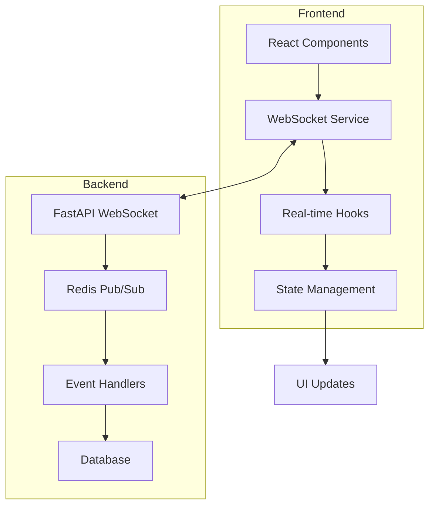

# Real-Time Collaboration Features

## Overview

The real-time collaboration system in Boardroom enables instant communication and synchronization across all connected users. Built on WebSocket technology, it provides a seamless collaborative experience for board meetings, decision-making, and document collaboration.

## Architecture

### System Components



### WebSocket Service Architecture

```typescript
interface WebSocketService {
  connect(token: string): Promise<void>
  disconnect(): void
  subscribe(event: string, handler: EventHandler): Unsubscribe
  send(event: string, data: any): void
  getState(): ConnectionState
}
```

## Core Features

### 1. Live Meeting Management

#### Features
- Real-time participant tracking
- Live agenda progression
- Speaker management
- Meeting chat with typing indicators
- Recording status updates

#### Implementation
```typescript
// Component usage
import { LiveMeeting } from '@/components/realtime'

<LiveMeeting
  meetingId={meetingId}
  onParticipantJoin={(participant) => console.log('Joined:', participant)}
  onAgendaProgress={(progress) => console.log('Progress:', progress)}
/>
```

#### WebSocket Events
- `meeting:join` - User joins meeting
- `meeting:leave` - User leaves meeting
- `meeting:chat` - Chat message sent
- `meeting:agenda:update` - Agenda item changed
- `meeting:speaker:change` - Active speaker changed

### 2. Real-Time Voting

#### Features
- Live vote submission
- Real-time result updates
- Vote validation
- Anonymous voting support
- Instant outcome determination

#### Implementation
```typescript
// Using the LiveVoting component
import { LiveVoting } from '@/components/realtime'

<LiveVoting
  decisionId={decisionId}
  initialData={{
    title: "Q4 Budget Approval",
    description: "Approve the Q4 2024 budget proposal",
    deadline: "2024-12-31T23:59:59Z",
    options: ["Approve", "Reject", "Abstain"],
    requiresComment: true
  }}
  onVoteSubmit={(vote) => console.log('Vote submitted:', vote)}
/>
```

#### Vote Synchronization
```typescript
// Real-time vote updates
interface VoteUpdate {
  decisionId: string
  userId: string
  vote: string
  timestamp: string
  comment?: string
}

// Subscribe to vote updates
websocket.subscribe('decision:vote', (update: VoteUpdate) => {
  // Update local state
  updateVoteCount(update)
})
```

### 3. Presence Management

#### Features
- Online/offline status
- User activity tracking
- Cursor position sharing
- Typing indicators
- Last seen timestamps

#### Implementation
```typescript
// Presence indicator usage
import { PresenceIndicator } from '@/components/realtime'

<PresenceIndicator 
  roomId={`meeting_${meetingId}`}
  showDetails={true}
  maxDisplay={5}
/>
```

#### Presence States
```typescript
type PresenceState = 
  | 'online'
  | 'away'
  | 'busy'
  | 'offline'

interface UserPresence {
  userId: string
  state: PresenceState
  lastSeen: string
  activity?: {
    type: 'viewing' | 'editing' | 'typing'
    target?: string
  }
}
```

### 4. Collaborative Editing

#### Features
- Real-time cursor tracking
- Collaborative text editing
- Conflict resolution
- Version history
- Auto-save functionality

#### Implementation
```typescript
// Cursor tracking
import { CursorTracker } from '@/components/realtime'

<CursorTracker
  documentId={documentId}
  onCursorMove={(cursor) => console.log('Cursor moved:', cursor)}
/>
```

### 5. Notification System

#### Features
- Toast notifications
- In-app notification center
- Browser push notifications
- Priority-based handling
- Notification history

#### Configuration
```typescript
// Notification types
interface Notification {
  id: string
  type: 'info' | 'success' | 'warning' | 'error'
  title: string
  message: string
  priority: 'low' | 'medium' | 'high'
  timestamp: string
  read: boolean
  actions?: NotificationAction[]
}

// Subscribe to notifications
websocket.subscribe('notification', (notification: Notification) => {
  showNotification(notification)
})
```

## WebSocket Protocol

### Connection Management

#### Connection Flow
1. Client requests WebSocket connection with JWT token
2. Server validates token and establishes connection
3. Client subscribes to relevant channels
4. Server sends initial state sync
5. Bidirectional communication established

#### Connection Configuration
```typescript
const wsConfig = {
  url: process.env.NEXT_PUBLIC_WS_URL || 'ws://localhost:8000/ws',
  reconnect: true,
  reconnectInterval: 1000,
  maxReconnectAttempts: 5,
  heartbeatInterval: 30000,
  timeout: 5000
}
```

### Message Format

#### Standard Message Structure
```json
{
  "type": "event_type",
  "data": {
    // Event-specific data
  },
  "metadata": {
    "timestamp": "2024-01-15T10:30:00Z",
    "userId": "user_123",
    "correlationId": "req_456"
  }
}
```

#### Event Types
- `connection:open` - Connection established
- `connection:close` - Connection closed
- `connection:error` - Connection error
- `heartbeat:ping` - Keep-alive ping
- `heartbeat:pong` - Keep-alive response

### Error Handling

#### Reconnection Strategy
```typescript
class ReconnectionStrategy {
  private attempts = 0
  private maxAttempts = 5
  private baseDelay = 1000
  
  getNextDelay(): number {
    return Math.min(
      this.baseDelay * Math.pow(2, this.attempts++),
      30000 // Max 30 seconds
    )
  }
  
  reset(): void {
    this.attempts = 0
  }
}
```

#### Error Recovery
- Automatic reconnection with exponential backoff
- Message queue for offline scenarios
- State reconciliation after reconnection
- User notification of connection issues

## Security Considerations

### Authentication
- JWT token validation on connection
- Token refresh handling
- Session timeout management
- Secure WebSocket (WSS) in production

### Authorization
- Channel-based permissions
- Message validation
- Rate limiting per connection
- IP-based access control

### Data Protection
- Message encryption for sensitive data
- Input sanitization
- XSS prevention
- CSRF protection for WebSocket upgrade

## Performance Optimization

### Client-Side Optimizations
- Message batching
- Throttled updates
- Selective subscriptions
- Local state caching
- Efficient re-rendering

### Server-Side Optimizations
- Connection pooling
- Redis pub/sub for scaling
- Message compression
- Efficient serialization
- Load balancing

### Monitoring Metrics
- Connection count
- Message throughput
- Latency measurements
- Error rates
- Resource usage

## Testing

### Unit Tests
```typescript
describe('WebSocket Service', () => {
  it('should establish connection', async () => {
    const ws = new WebSocketService()
    await ws.connect('test-token')
    expect(ws.getState()).toBe('connected')
  })
  
  it('should handle reconnection', async () => {
    const ws = new WebSocketService()
    await ws.connect('test-token')
    ws.disconnect()
    await ws.connect('test-token')
    expect(ws.getState()).toBe('connected')
  })
})
```

### Integration Tests
- End-to-end connection testing
- Multi-client synchronization
- Offline/online transitions
- Performance under load
- Security testing

## Troubleshooting

### Common Issues

#### Connection Failures
- **Issue**: WebSocket fails to connect
- **Causes**: Invalid token, network issues, server down
- **Solution**: Check token validity, network connectivity, server logs

#### Message Loss
- **Issue**: Messages not received
- **Causes**: Network interruption, client disconnect
- **Solution**: Implement message acknowledgment, queue offline messages

#### Performance Degradation
- **Issue**: Slow updates or high latency
- **Causes**: Too many subscriptions, large messages, network congestion
- **Solution**: Optimize subscriptions, compress messages, implement pagination

### Debug Mode
```typescript
// Enable debug logging
const ws = new WebSocketService({ debug: true })

// Debug events
ws.on('debug', (info) => {
  console.log('WebSocket Debug:', info)
})
```

## Best Practices

### Client Implementation
1. **Selective Subscriptions**: Only subscribe to necessary events
2. **Cleanup**: Unsubscribe when components unmount
3. **Error Handling**: Implement proper error boundaries
4. **State Management**: Use optimistic updates wisely
5. **Performance**: Throttle frequent updates

### Server Implementation
1. **Scalability**: Use Redis pub/sub for horizontal scaling
2. **Security**: Validate all incoming messages
3. **Monitoring**: Track connection metrics
4. **Rate Limiting**: Prevent abuse
5. **Graceful Shutdown**: Handle disconnections properly

## Migration Guide

### From Polling to WebSocket
```typescript
// Before: Polling approach
useEffect(() => {
  const interval = setInterval(async () => {
    const data = await fetchMeetingData(meetingId)
    setMeetingData(data)
  }, 5000)
  
  return () => clearInterval(interval)
}, [meetingId])

// After: WebSocket approach
useEffect(() => {
  const unsubscribe = websocket.subscribe(
    `meeting:${meetingId}`,
    (data) => setMeetingData(data)
  )
  
  return unsubscribe
}, [meetingId])
```

## Future Enhancements

### Planned Features
- WebRTC integration for video/audio
- Screen sharing capabilities
- Advanced presence states
- Collaborative whiteboard
- Real-time translation

### Performance Improvements
- Binary protocol support
- Advanced compression
- Edge computing integration
- Predictive pre-loading
- AI-powered optimization

---

For more information on specific components, refer to the [API Documentation](../api/websocket-api.md) or the [Component Reference](../../src/components/realtime/README.md).