# Security Enhancements

## Overview

Phase 3 introduces comprehensive security enhancements to the Boardroom platform, implementing enterprise-grade security features including multi-factor authentication (MFA), advanced session management, role-based access control (RBAC), and security monitoring. These features ensure data protection, user privacy, and compliance with security standards.

## Security Architecture

### Multi-Layer Security Model

```mermaid
graph TB
    subgraph "Frontend Security"
        A[Input Validation] --> B[XSS Prevention]
        B --> C[CSRF Protection]
        C --> D[Content Security Policy]
    end
    
    subgraph "Authentication Layer"
        E[JWT Authentication] --> F[MFA Support]
        F --> G[Session Management]
        G --> H[Device Tracking]
    end
    
    subgraph "Authorization Layer"
        I[RBAC System] --> J[Permission Checks]
        J --> K[Resource Access Control]
        K --> L[Audit Logging]
    end
    
    subgraph "Data Protection"
        M[Encryption at Rest] --> N[Encryption in Transit]
        N --> O[Key Management]
        O --> P[Data Sanitization]
    end
```



## Multi-Factor Authentication (MFA)

### Implementation Overview

The MFA system supports multiple authentication methods to provide flexible security options for users while maintaining high security standards.

#### Supported Methods

1. **Time-Based One-Time Password (TOTP)**
   - Compatible with Google Authenticator, Authy, etc.
   - 30-second token rotation
   - QR code setup process

2. **SMS Authentication**
   - Backup method for TOTP
   - Rate-limited to prevent abuse
   - Secure token delivery

3. **Backup Codes**
   - One-time use recovery codes
   - Securely generated and stored
   - 8 codes per user

### MFA Setup Component

```typescript
// MfaSetup.tsx implementation
interface MfaSetupProps {
  userId: string
  onComplete: () => void
}

const MfaSetup: React.FC<MfaSetupProps> = ({ userId, onComplete }) => {
  const [step, setStep] = useState<'qr' | 'verify' | 'backup'>('qr')
  const [secret, setSecret] = useState<string>('')
  const [qrCode, setQrCode] = useState<string>('')
  const [backupCodes, setBackupCodes] = useState<string[]>([])
  
  // Generate TOTP secret and QR code
  const initializeMfa = async () => {
    const response = await securityService.initializeMfa(userId)
    setSecret(response.secret)
    setQrCode(response.qrCode)
  }
  
  // Verify TOTP token
  const verifyToken = async (token: string) => {
    const isValid = await securityService.verifyMfaToken(userId, token)
    if (isValid) {
      const codes = await securityService.generateBackupCodes(userId)
      setBackupCodes(codes)
      setStep('backup')
    }
  }
  
  return (
    <div className="mfa-setup">
      {step === 'qr' && <QRCodeStep qrCode={qrCode} onNext={() => setStep('verify')} />}
      {step === 'verify' && <VerifyStep onVerify={verifyToken} />}
      {step === 'backup' && <BackupCodesStep codes={backupCodes} onComplete={onComplete} />}
    </div>
  )
}
```

### MFA Service Implementation

```typescript
class MfaService {
  async initializeMfa(userId: string): Promise<MfaInitResponse> {
    // Generate secret
    const secret = authenticator.generateSecret()
    
    // Store encrypted secret
    await this.storeSecret(userId, this.encrypt(secret))
    
    // Generate QR code
    const otpauth = authenticator.keyuri(
      userId,
      'Boardroom',
      secret
    )
    const qrCode = await QRCode.toDataURL(otpauth)
    
    return { secret, qrCode, backupCodes: [] }
  }
  
  async verifyToken(userId: string, token: string): Promise<boolean> {
    const encryptedSecret = await this.getSecret(userId)
    const secret = this.decrypt(encryptedSecret)
    
    return authenticator.verify({
      token,
      secret,
      window: 1 // Allow 1 window for clock drift
    })
  }
  
  async generateBackupCodes(userId: string): Promise<string[]> {
    const codes = Array.from({ length: 8 }, () => 
      this.generateSecureCode()
    )
    
    // Hash and store codes
    const hashedCodes = codes.map(code => this.hash(code))
    await this.storeBackupCodes(userId, hashedCodes)
    
    return codes
  }
  
  private generateSecureCode(): string {
    return crypto.randomBytes(4).toString('hex').toUpperCase()
  }
}
```

## Password Security

### Password Strength Meter

The password strength meter provides real-time feedback on password security, helping users create strong passwords.

```typescript
interface PasswordStrength {
  score: number // 0-100
  level: 'weak' | 'fair' | 'good' | 'strong'
  feedback: string[]
  requirements: PasswordRequirement[]
}

const calculatePasswordStrength = (password: string): PasswordStrength => {
  let score = 0
  const feedback: string[] = []
  
  // Length check
  if (password.length >= 12) score += 20
  else feedback.push('Use at least 12 characters')
  
  // Character variety
  if (/[a-z]/.test(password)) score += 15
  else feedback.push('Include lowercase letters')
  
  if (/[A-Z]/.test(password)) score += 15
  else feedback.push('Include uppercase letters')
  
  if (/\d/.test(password)) score += 15
  else feedback.push('Include numbers')
  
  if (/[^a-zA-Z0-9]/.test(password)) score += 15
  else feedback.push('Include special characters')
  
  // Common patterns check
  if (!isCommonPassword(password)) score += 20
  else feedback.push('Avoid common passwords')
  
  return {
    score,
    level: getStrengthLevel(score),
    feedback,
    requirements: getRequirements()
  }
}
```

### Password Policy Enforcement

```typescript
interface PasswordPolicy {
  minLength: number
  requireUppercase: boolean
  requireLowercase: boolean
  requireNumbers: boolean
  requireSpecialChars: boolean
  preventCommonPasswords: boolean
  preventReuse: number // Number of previous passwords to check
  expirationDays: number
}

class PasswordPolicyService {
  private policy: PasswordPolicy = {
    minLength: 12,
    requireUppercase: true,
    requireLowercase: true,
    requireNumbers: true,
    requireSpecialChars: true,
    preventCommonPasswords: true,
    preventReuse: 5,
    expirationDays: 90
  }
  
  validatePassword(password: string, userId?: string): ValidationResult {
    const errors: string[] = []
    
    // Length check
    if (password.length < this.policy.minLength) {
      errors.push(`Password must be at least ${this.policy.minLength} characters`)
    }
    
    // Character requirements
    if (this.policy.requireUppercase && !/[A-Z]/.test(password)) {
      errors.push('Password must contain uppercase letters')
    }
    
    // Check password history
    if (userId && this.policy.preventReuse > 0) {
      const isReused = await this.checkPasswordHistory(userId, password)
      if (isReused) {
        errors.push(`Cannot reuse last ${this.policy.preventReuse} passwords`)
      }
    }
    
    return {
      valid: errors.length === 0,
      errors
    }
  }
}
```

## Session Management

### Advanced Session Control

The session management system provides comprehensive control over user sessions with security features to prevent session hijacking and unauthorized access.

```typescript
interface Session {
  id: string
  userId: string
  deviceId: string
  deviceInfo: DeviceInfo
  ipAddress: string
  location?: GeoLocation
  createdAt: Date
  lastActivity: Date
  expiresAt: Date
  isActive: boolean
  riskScore: number
}

class SessionManager {
  async createSession(userId: string, request: Request): Promise<Session> {
    const deviceInfo = this.extractDeviceInfo(request)
    const ipAddress = this.getClientIP(request)
    const location = await this.getGeoLocation(ipAddress)
    
    const session: Session = {
      id: generateSecureId(),
      userId,
      deviceId: this.generateDeviceId(deviceInfo),
      deviceInfo,
      ipAddress,
      location,
      createdAt: new Date(),
      lastActivity: new Date(),
      expiresAt: new Date(Date.now() + SESSION_TIMEOUT),
      isActive: true,
      riskScore: this.calculateRiskScore(deviceInfo, location)
    }
    
    // Check for suspicious activity
    if (session.riskScore > RISK_THRESHOLD) {
      await this.handleSuspiciousActivity(session)
    }
    
    await this.storeSession(session)
    return session
  }
  
  async validateSession(sessionId: string): Promise<boolean> {
    const session = await this.getSession(sessionId)
    
    if (!session || !session.isActive) return false
    if (new Date() > session.expiresAt) return false
    
    // Update last activity
    await this.updateLastActivity(sessionId)
    
    return true
  }
  
  async terminateSession(sessionId: string): Promise<void> {
    await this.updateSession(sessionId, { isActive: false })
    await this.revokeTokens(sessionId)
    await this.logSessionTermination(sessionId)
  }
}
```

### Session Monitoring Dashboard

```typescript
const SessionManager: React.FC = () => {
  const { sessions, activeSessions } = useSessionData()
  const [selectedSession, setSelectedSession] = useState<Session | null>(null)
  
  const terminateSession = async (sessionId: string) => {
    await securityService.terminateSession(sessionId)
    // Refresh session list
  }
  
  const terminateAllSessions = async () => {
    await securityService.terminateAllSessions()
    // Force re-authentication
  }
  
  return (
    <div className="session-manager">
      <div className="session-stats">
        <h3>Active Sessions: {activeSessions.length}</h3>
        <Button onClick={terminateAllSessions} variant="danger">
          Terminate All Sessions
        </Button>
      </div>
      
      <div className="session-list">
        {sessions.map(session => (
          <SessionCard
            key={session.id}
            session={session}
            onTerminate={() => terminateSession(session.id)}
            onSelect={() => setSelectedSession(session)}
          />
        ))}
      </div>
      
      {selectedSession && (
        <SessionDetails
          session={selectedSession}
          onClose={() => setSelectedSession(null)}
        />
      )}
    </div>
  )
}
```

## Role-Based Access Control (RBAC)

### RBAC Implementation

```typescript
interface Role {
  id: string
  name: string
  description: string
  permissions: Permission[]
  isSystem: boolean // System roles cannot be modified
}

interface Permission {
  id: string
  resource: string
  action: string
  constraints?: Record<string, any>
}

class RbacService {
  async checkPermission(
    userId: string,
    resource: string,
    action: string,
    context?: Record<string, any>
  ): Promise<boolean> {
    const userRoles = await this.getUserRoles(userId)
    
    for (const role of userRoles) {
      const hasPermission = role.permissions.some(permission =>
        this.matchesPermission(permission, resource, action, context)
      )
      
      if (hasPermission) {
        await this.logAccessGranted(userId, resource, action)
        return true
      }
    }
    
    await this.logAccessDenied(userId, resource, action)
    return false
  }
  
  private matchesPermission(
    permission: Permission,
    resource: string,
    action: string,
    context?: Record<string, any>
  ): boolean {
    // Resource matching (supports wildcards)
    if (!this.matchesPattern(permission.resource, resource)) {
      return false
    }
    
    // Action matching
    if (permission.action !== '*' && permission.action !== action) {
      return false
    }
    
    // Constraint evaluation
    if (permission.constraints && context) {
      return this.evaluateConstraints(permission.constraints, context)
    }
    
    return true
  }
}
```

### Permission Decorators

```typescript
// Frontend permission checks
const RequirePermission: React.FC<{
  resource: string
  action: string
  fallback?: React.ReactNode
  children: React.ReactNode
}> = ({ resource, action, fallback, children }) => {
  const { hasPermission } = usePermissions()
  
  if (!hasPermission(resource, action)) {
    return fallback || null
  }
  
  return <>{children}</>
}

// Usage
<RequirePermission resource="boardroom" action="create">
  <CreateBoardroomButton />
</RequirePermission>
```

## Security Monitoring

### Security Dashboard Component

```typescript
const SecurityDashboard: React.FC = () => {
  const { alerts, metrics, logs } = useSecurityData()
  
  return (
    <div className="security-dashboard">
      <div className="security-alerts">
        <h2>Security Alerts</h2>
        {alerts.map(alert => (
          <SecurityAlert
            key={alert.id}
            alert={alert}
            onResolve={() => resolveAlert(alert.id)}
          />
        ))}
      </div>
      
      <div className="security-metrics">
        <MetricCard
          title="Failed Login Attempts"
          value={metrics.failedLogins}
          trend={metrics.failedLoginsTrend}
        />
        <MetricCard
          title="Suspicious Activities"
          value={metrics.suspiciousActivities}
          trend={metrics.suspiciousActivitiesTrend}
        />
        <MetricCard
          title="Active Threats"
          value={metrics.activeThreats}
          status="critical"
        />
      </div>
      
      <div className="audit-logs">
        <h2>Recent Security Events</h2>
        <AuditLogViewer logs={logs} />
      </div>
    </div>
  )
}
```

### Security Event Monitoring

```typescript
class SecurityMonitor {
  private rules: SecurityRule[] = []
  private alerts: SecurityAlert[] = []
  
  async monitorEvent(event: SecurityEvent): Promise<void> {
    // Check against security rules
    for (const rule of this.rules) {
      if (this.matchesRule(event, rule)) {
        await this.handleSecurityIncident(event, rule)
      }
    }
    
    // Update metrics
    await this.updateSecurityMetrics(event)
    
    // Log event
    await this.logSecurityEvent(event)
  }
  
  private async handleSecurityIncident(
    event: SecurityEvent,
    rule: SecurityRule
  ): Promise<void> {
    const alert: SecurityAlert = {
      id: generateId(),
      severity: rule.severity,
      type: rule.type,
      message: rule.message,
      event,
      timestamp: new Date(),
      status: 'active'
    }
    
    this.alerts.push(alert)
    
    // Take automated action if configured
    if (rule.action) {
      await this.executeSecurityAction(rule.action, event)
    }
    
    // Notify security team
    await this.notifySecurityTeam(alert)
  }
}
```

## Data Protection

### Encryption Service

```typescript
class EncryptionService {
  private algorithm = 'aes-256-gcm'
  private keyDerivationIterations = 100000
  
  async encryptData(data: string, key: string): Promise<EncryptedData> {
    const salt = crypto.randomBytes(32)
    const derivedKey = await this.deriveKey(key, salt)
    const iv = crypto.randomBytes(16)
    
    const cipher = crypto.createCipheriv(this.algorithm, derivedKey, iv)
    
    let encrypted = cipher.update(data, 'utf8', 'hex')
    encrypted += cipher.final('hex')
    
    const authTag = cipher.getAuthTag()
    
    return {
      encrypted,
      salt: salt.toString('hex'),
      iv: iv.toString('hex'),
      authTag: authTag.toString('hex')
    }
  }
  
  async decryptData(
    encryptedData: EncryptedData,
    key: string
  ): Promise<string> {
    const salt = Buffer.from(encryptedData.salt, 'hex')
    const derivedKey = await this.deriveKey(key, salt)
    const iv = Buffer.from(encryptedData.iv, 'hex')
    const authTag = Buffer.from(encryptedData.authTag, 'hex')
    
    const decipher = crypto.createDecipheriv(this.algorithm, derivedKey, iv)
    decipher.setAuthTag(authTag)
    
    let decrypted = decipher.update(encryptedData.encrypted, 'hex', 'utf8')
    decrypted += decipher.final('utf8')
    
    return decrypted
  }
  
  private async deriveKey(password: string, salt: Buffer): Promise<Buffer> {
    return new Promise((resolve, reject) => {
      crypto.pbkdf2(
        password,
        salt,
        this.keyDerivationIterations,
        32,
        'sha256',
        (err, derivedKey) => {
          if (err) reject(err)
          else resolve(derivedKey)
        }
      )
    })
  }
}
```

### Input Sanitization

```typescript
class SanitizationService {
  sanitizeHtml(input: string): string {
    return DOMPurify.sanitize(input, {
      ALLOWED_TAGS: ['b', 'i', 'em', 'strong', 'a', 'p', 'br'],
      ALLOWED_ATTR: ['href', 'target', 'rel']
    })
  }
  
  sanitizeFilename(filename: string): string {
    return filename
      .replace(/[^a-zA-Z0-9.-]/g, '_')
      .replace(/\.{2,}/g, '.')
      .substring(0, 255)
  }
  
  sanitizeUrl(url: string): string | null {
    try {
      const parsed = new URL(url)
      
      // Only allow specific protocols
      if (!['http:', 'https:'].includes(parsed.protocol)) {
        return null
      }
      
      // Prevent javascript: and data: URLs
      if (parsed.href.match(/^(javascript|data):/i)) {
        return null
      }
      
      return parsed.href
    } catch {
      return null
    }
  }
  
  sanitizeJson(input: any): any {
    if (typeof input === 'string') {
      return this.sanitizeString(input)
    }
    
    if (Array.isArray(input)) {
      return input.map(item => this.sanitizeJson(item))
    }
    
    if (typeof input === 'object' && input !== null) {
      const sanitized: any = {}
      for (const [key, value] of Object.entries(input)) {
        sanitized[this.sanitizeString(key)] = this.sanitizeJson(value)
      }
      return sanitized
    }
    
    return input
  }
}
```

## Security Headers

### Content Security Policy

```typescript
const cspDirectives = {
  'default-src': ["'self'"],
  'script-src': ["'self'", "'unsafe-inline'", 'https://apis.google.com'],
  'style-src': ["'self'", "'unsafe-inline'"],
  'img-src': ["'self'", 'data:', 'https:'],
  'font-src': ["'self'"],
  'connect-src': ["'self'", 'wss:', process.env.NEXT_PUBLIC_API_URL],
  'frame-ancestors': ["'none'"],
  'base-uri': ["'self'"],
  'form-action': ["'self'"],
  'upgrade-insecure-requests': []
}

// Next.js security headers
const securityHeaders = [
  {
    key: 'Content-Security-Policy',
    value: Object.entries(cspDirectives)
      .map(([key, values]) => `${key} ${values.join(' ')}`)
      .join('; ')
  },
  {
    key: 'X-Frame-Options',
    value: 'DENY'
  },
  {
    key: 'X-Content-Type-Options',
    value: 'nosniff'
  },
  {
    key: 'Referrer-Policy',
    value: 'strict-origin-when-cross-origin'
  },
  {
    key: 'Permissions-Policy',
    value: 'camera=(), microphone=(), geolocation=()'
  }
]
```

## Audit Logging

### Comprehensive Audit System

```typescript
interface AuditLog {
  id: string
  userId: string
  action: string
  resource: string
  resourceId?: string
  result: 'success' | 'failure'
  metadata: Record<string, any>
  ipAddress: string
  userAgent: string
  timestamp: Date
}

class AuditService {
  async log(event: AuditEvent): Promise<void> {
    const auditLog: AuditLog = {
      id: generateId(),
      userId: event.userId,
      action: event.action,
      resource: event.resource,
      resourceId: event.resourceId,
      result: event.result,
      metadata: this.sanitizeMetadata(event.metadata),
      ipAddress: event.request.ip,
      userAgent: event.request.userAgent,
      timestamp: new Date()
    }
    
    // Store in database
    await this.storeAuditLog(auditLog)
    
    // Check for suspicious patterns
    await this.analyzeSuspiciousActivity(auditLog)
    
    // Archive old logs
    if (Math.random() < 0.01) { // 1% chance
      await this.archiveOldLogs()
    }
  }
  
  async query(filters: AuditFilters): Promise<AuditLog[]> {
    return this.repository.find({
      where: this.buildWhereClause(filters),
      order: { timestamp: 'DESC' },
      limit: filters.limit || 100
    })
  }
}
```

## Security Best Practices

### Frontend Security Guidelines

1. **Input Validation**
   - Validate all user inputs on the client side
   - Never trust client-side validation alone
   - Use schema validation libraries (Zod)
   - Sanitize HTML content with DOMPurify

2. **Authentication**
   - Store tokens in httpOnly cookies
   - Implement token refresh mechanism
   - Clear tokens on logout
   - Use secure flag in production

3. **State Management**
   - Don't store sensitive data in localStorage
   - Clear sensitive data from memory
   - Use encryption for sensitive state
   - Implement state expiration

4. **API Communication**
   - Always use HTTPS in production
   - Implement request signing
   - Validate SSL certificates
   - Use CORS properly

### Security Checklist

- [ ] All forms have CSRF protection
- [ ] XSS prevention measures in place
- [ ] Content Security Policy configured
- [ ] Security headers implemented
- [ ] Input validation on all fields
- [ ] Output encoding implemented
- [ ] Authentication tokens secure
- [ ] Session management secure
- [ ] RBAC properly configured
- [ ] Audit logging enabled
- [ ] Encryption keys rotated
- [ ] Security monitoring active
- [ ] Incident response plan ready
- [ ] Regular security audits scheduled

## Compliance & Standards

### GDPR Compliance

```typescript
class GdprCompliance {
  // Right to be forgotten
  async deleteUserData(userId: string): Promise<void> {
    // Delete personal data
    await this.deletePersonalData(userId)
    
    // Anonymize historical data
    await this.anonymizeHistoricalData(userId)
    
    // Remove from backups (mark for deletion)
    await this.markForBackupDeletion(userId)
    
    // Log deletion
    await this.logDataDeletion(userId)
  }
  
  // Data portability
  async exportUserData(userId: string): Promise<UserDataExport> {
    const data = await this.collectUserData(userId)
    
    return {
      profile: data.profile,
      activities: data.activities,
      preferences: data.preferences,
      generatedAt: new Date(),
      format: 'json'
    }
  }
}
```

### Security Metrics

```typescript
interface SecurityMetrics {
  authentication: {
    successRate: number
    failureRate: number
    mfaAdoptionRate: number
    averageSessionDuration: number
  }
  incidents: {
    total: number
    critical: number
    resolved: number
    averageResolutionTime: number
  }
  compliance: {
    dataRetentionCompliance: number
    encryptionCoverage: number
    auditLogCompleteness: number
  }
}
```

## Testing Security Features

### Security Test Suite

```typescript
describe('Security Features', () => {
  describe('MFA', () => {
    it('should generate valid TOTP tokens', async () => {
      const { secret } = await mfaService.initializeMfa('user123')
      const token = authenticator.generate(secret)
      
      expect(await mfaService.verifyToken('user123', token)).toBe(true)
    })
    
    it('should reject invalid tokens', async () => {
      expect(await mfaService.verifyToken('user123', '000000')).toBe(false)
    })
  })
  
  describe('Session Management', () => {
    it('should detect suspicious login attempts', async () => {
      const session = await sessionManager.createSession('user123', {
        ip: '192.168.1.1',
        userAgent: 'Mozilla/5.0...'
      })
      
      expect(session.riskScore).toBeGreaterThan(0)
    })
  })
  
  describe('RBAC', () => {
    it('should enforce permissions', async () => {
      const canCreate = await rbacService.checkPermission(
        'user123',
        'boardroom',
        'create'
      )
      
      expect(canCreate).toBe(false)
    })
  })
})
```

---

For more details on implementation, see the [Security API Documentation](../api/security-api.md) or the [Security Components](../../src/components/security/).