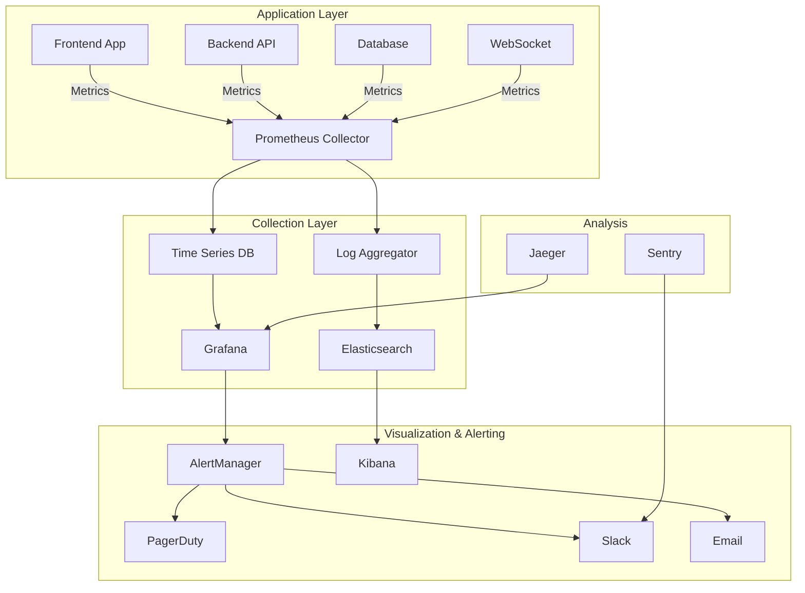

# Monitoring and Alerting Guide

## Overview

This guide provides comprehensive instructions for setting up and managing monitoring and alerting for the Boardroom Phase 3 platform. It covers metrics collection, visualization, alerting rules, incident response, and best practices for maintaining system reliability.

## Monitoring Architecture



## Metrics Collection

### 1. Application Metrics

#### Frontend Metrics Collection

```typescript
// monitoring/frontend-metrics.ts
import { register, Counter, Histogram, Gauge } from 'prom-client'

// Define metrics
const pageLoadTime = new Histogram({
  name: 'frontend_page_load_duration_seconds',
  help: 'Page load time in seconds',
  labelNames: ['page', 'status'],
  buckets: [0.1, 0.5, 1, 2, 5, 10]
})

const apiCallDuration = new Histogram({
  name: 'frontend_api_call_duration_seconds',
  help: 'API call duration in seconds',
  labelNames: ['endpoint', 'method', 'status'],
  buckets: [0.05, 0.1, 0.5, 1, 2, 5]
})

const activeUsers = new Gauge({
  name: 'frontend_active_users',
  help: 'Number of active users',
  labelNames: ['boardroom']
})

const jsErrors = new Counter({
  name: 'frontend_js_errors_total',
  help: 'Total number of JavaScript errors',
  labelNames: ['page', 'error_type']
})

// Collect metrics
export class MetricsCollector {
  private static instance: MetricsCollector
  
  static getInstance(): MetricsCollector {
    if (!MetricsCollector.instance) {
      MetricsCollector.instance = new MetricsCollector()
    }
    return MetricsCollector.instance
  }
  
  recordPageLoad(page: string, duration: number, status: 'success' | 'error') {
    pageLoadTime.observe({ page, status }, duration)
  }
  
  recordApiCall(endpoint: string, method: string, duration: number, status: number) {
    apiCallDuration.observe(
      { endpoint, method, status: status.toString() },
      duration
    )
  }
  
  setActiveUsers(boardroom: string, count: number) {
    activeUsers.set({ boardroom }, count)
  }
  
  recordError(page: string, errorType: string) {
    jsErrors.inc({ page, error_type: errorType })
  }
  
  async getMetrics(): Promise<string> {
    return register.metrics()
  }
}

// Auto-collect browser metrics
if (typeof window !== 'undefined') {
  const collector = MetricsCollector.getInstance()
  
  // Page load metrics
  window.addEventListener('load', () => {
    const perfData = performance.getEntriesByType('navigation')[0] as PerformanceNavigationTiming
    const loadTime = perfData.loadEventEnd - perfData.fetchStart
    collector.recordPageLoad(window.location.pathname, loadTime / 1000, 'success')
  })
  
  // Error tracking
  window.addEventListener('error', (event) => {
    collector.recordError(
      window.location.pathname,
      event.error?.name || 'UnknownError'
    )
  })
}
```

#### Backend Metrics Collection

```python
# monitoring/backend_metrics.py
from prometheus_client import Counter, Histogram, Gauge, Info, generate_latest
from prometheus_client.core import CollectorRegistry
from functools import wraps
import time
import psutil
import asyncio

# Create registry
registry = CollectorRegistry()

# Define metrics
http_requests_total = Counter(
    'http_requests_total',
    'Total HTTP requests',
    ['method', 'endpoint', 'status'],
    registry=registry
)

http_request_duration = Histogram(
    'http_request_duration_seconds',
    'HTTP request duration',
    ['method', 'endpoint'],
    buckets=[0.01, 0.05, 0.1, 0.5, 1.0, 5.0],
    registry=registry
)

ws_connections = Gauge(
    'websocket_connections_active',
    'Active WebSocket connections',
    ['room_type'],
    registry=registry
)

db_pool_size = Gauge(
    'db_connection_pool_size',
    'Database connection pool size',
    ['status'],
    registry=registry
)

cache_operations = Counter(
    'cache_operations_total',
    'Cache operations',
    ['operation', 'result'],
    registry=registry
)

background_tasks = Gauge(
    'background_tasks_active',
    'Active background tasks',
    ['task_type'],
    registry=registry
)

# System metrics
system_info = Info(
    'system_info',
    'System information',
    registry=registry
)

cpu_usage = Gauge(
    'system_cpu_usage_percent',
    'CPU usage percentage',
    registry=registry
)

memory_usage = Gauge(
    'system_memory_usage_bytes',
    'Memory usage in bytes',
    ['type'],
    registry=registry
)

class MetricsCollector:
    def __init__(self):
        self.registry = registry
        self._start_system_metrics_collection()
    
    def track_request(self, method: str, endpoint: str, status: int, duration: float):
        """Track HTTP request metrics"""
        http_requests_total.labels(
            method=method,
            endpoint=endpoint,
            status=str(status)
        ).inc()
        
        http_request_duration.labels(
            method=method,
            endpoint=endpoint
        ).observe(duration)
    
    def track_ws_connection(self, room_type: str, delta: int):
        """Track WebSocket connections"""
        ws_connections.labels(room_type=room_type).inc(delta)
    
    def track_cache_operation(self, operation: str, hit: bool):
        """Track cache operations"""
        result = 'hit' if hit else 'miss'
        cache_operations.labels(
            operation=operation,
            result=result
        ).inc()
    
    def set_db_pool_metrics(self, active: int, idle: int, total: int):
        """Update database pool metrics"""
        db_pool_size.labels(status='active').set(active)
        db_pool_size.labels(status='idle').set(idle)
        db_pool_size.labels(status='total').set(total)
    
    def track_background_task(self, task_type: str, delta: int):
        """Track background tasks"""
        background_tasks.labels(task_type=task_type).inc(delta)
    
    def _start_system_metrics_collection(self):
        """Start collecting system metrics"""
        async def collect_system_metrics():
            while True:
                # CPU usage
                cpu_usage.set(psutil.cpu_percent(interval=1))
                
                # Memory usage
                memory = psutil.virtual_memory()
                memory_usage.labels(type='used').set(memory.used)
                memory_usage.labels(type='available').set(memory.available)
                memory_usage.labels(type='total').set(memory.total)
                
                # System info
                system_info.info({
                    'python_version': sys.version,
                    'platform': platform.platform(),
                    'processor': platform.processor()
                })
                
                await asyncio.sleep(10)
        
        asyncio.create_task(collect_system_metrics())
    
    def get_metrics(self) -> bytes:
        """Get metrics in Prometheus format"""
        return generate_latest(self.registry)

# Decorators for easy metric collection
def track_endpoint_metrics(endpoint: str = None):
    """Decorator to track endpoint metrics"""
    def decorator(func):
        @wraps(func)
        async def wrapper(request, *args, **kwargs):
            start_time = time.time()
            status = 200
            
            try:
                response = await func(request, *args, **kwargs)
                status = getattr(response, 'status_code', 200)
                return response
            except Exception as e:
                status = 500
                raise
            finally:
                duration = time.time() - start_time
                endpoint_name = endpoint or request.url.path
                
                metrics_collector.track_request(
                    method=request.method,
                    endpoint=endpoint_name,
                    status=status,
                    duration=duration
                )
        
        return wrapper
    return decorator

# Global metrics collector instance
metrics_collector = MetricsCollector()
```

### 2. Infrastructure Metrics

#### Docker Metrics

```yaml
# docker-compose.monitoring.yml
version: '3.8'

services:
  prometheus:
    image: prom/prometheus:latest
    volumes:
      - ./prometheus.yml:/etc/prometheus/prometheus.yml
      - prometheus_data:/prometheus
    ports:
      - "9090:9090"
    command:
      - '--config.file=/etc/prometheus/prometheus.yml'
      - '--storage.tsdb.path=/prometheus'
      - '--web.console.libraries=/usr/share/prometheus/console_libraries'
      - '--web.console.templates=/usr/share/prometheus/consoles'
      - '--web.enable-lifecycle'
      - '--storage.tsdb.retention.time=30d'
    networks:
      - boardroom_network

  node_exporter:
    image: prom/node-exporter:latest
    ports:
      - "9100:9100"
    volumes:
      - /proc:/host/proc:ro
      - /sys:/host/sys:ro
      - /:/rootfs:ro
    command:
      - '--path.procfs=/host/proc'
      - '--path.sysfs=/host/sys'
      - '--collector.filesystem.mount-points-exclude=^/(sys|proc|dev|host|etc)($$|/)'
    networks:
      - boardroom_network

  cadvisor:
    image: gcr.io/cadvisor/cadvisor:latest
    ports:
      - "8080:8080"
    volumes:
      - /:/rootfs:ro
      - /var/run:/var/run:ro
      - /sys:/sys:ro
      - /var/lib/docker/:/var/lib/docker:ro
      - /cgroup:/cgroup:ro
    devices:
      - /dev/kmsg
    networks:
      - boardroom_network

  postgres_exporter:
    image: prometheuscommunity/postgres-exporter
    environment:
      DATA_SOURCE_NAME: "postgresql://postgres:password@db:5432/boardroom?sslmode=disable"
    ports:
      - "9187:9187"
    networks:
      - boardroom_network

  redis_exporter:
    image: oliver006/redis_exporter
    environment:
      REDIS_ADDR: "redis://redis:6379"
    ports:
      - "9121:9121"
    networks:
      - boardroom_network

volumes:
  prometheus_data:

networks:
  boardroom_network:
    external: true
```

#### Prometheus Configuration

```yaml
# prometheus.yml
global:
  scrape_interval: 15s
  evaluation_interval: 15s
  external_labels:
    environment: 'production'
    region: 'us-east-1'

# Alertmanager configuration
alerting:
  alertmanagers:
    - static_configs:
        - targets:
            - alertmanager:9093

# Load rules
rule_files:
  - "alerts/*.yml"

# Scrape configurations
scrape_configs:
  # Frontend metrics
  - job_name: 'frontend'
    static_configs:
      - targets: ['frontend:3000']
    metrics_path: '/api/metrics'

  # Backend metrics
  - job_name: 'backend'
    static_configs:
      - targets: ['backend:8000']
    metrics_path: '/metrics'

  # Node exporter
  - job_name: 'node'
    static_configs:
      - targets: ['node_exporter:9100']

  # Docker containers
  - job_name: 'cadvisor'
    static_configs:
      - targets: ['cadvisor:8080']

  # PostgreSQL
  - job_name: 'postgres'
    static_configs:
      - targets: ['postgres_exporter:9187']

  # Redis
  - job_name: 'redis'
    static_configs:
      - targets: ['redis_exporter:9121']

  # Kubernetes pods (if using K8s)
  - job_name: 'kubernetes-pods'
    kubernetes_sd_configs:
      - role: pod
    relabel_configs:
      - source_labels: [__meta_kubernetes_pod_annotation_prometheus_io_scrape]
        action: keep
        regex: true
      - source_labels: [__meta_kubernetes_pod_annotation_prometheus_io_path]
        action: replace
        target_label: __metrics_path__
        regex: (.+)
```

## Visualization with Grafana

### 1. Grafana Setup

```yaml
# docker-compose.grafana.yml
version: '3.8'

services:
  grafana:
    image: grafana/grafana:latest
    ports:
      - "3001:3000"
    environment:
      - GF_SECURITY_ADMIN_PASSWORD=admin
      - GF_USERS_ALLOW_SIGN_UP=false
      - GF_INSTALL_PLUGINS=grafana-piechart-panel,grafana-worldmap-panel
    volumes:
      - grafana_data:/var/lib/grafana
      - ./grafana/provisioning:/etc/grafana/provisioning
      - ./grafana/dashboards:/var/lib/grafana/dashboards
    networks:
      - boardroom_network

volumes:
  grafana_data:
```

### 2. Dashboard Configuration

#### Main Application Dashboard

```json
{
  "dashboard": {
    "id": null,
    "uid": "boardroom-main",
    "title": "Boardroom Application Overview",
    "tags": ["boardroom", "application"],
    "timezone": "browser",
    "schemaVersion": 16,
    "version": 0,
    "refresh": "10s",
    "panels": [
      {
        "id": 1,
        "gridPos": {"h": 8, "w": 12, "x": 0, "y": 0},
        "type": "graph",
        "title": "Request Rate",
        "targets": [
          {
            "expr": "sum(rate(http_requests_total[5m])) by (method)",
            "legendFormat": "{{method}}"
          }
        ],
        "yaxes": [
          {
            "format": "reqps",
            "label": "Requests/sec"
          }
        ]
      },
      {
        "id": 2,
        "gridPos": {"h": 8, "w": 12, "x": 12, "y": 0},
        "type": "graph",
        "title": "Response Time (p50, p95, p99)",
        "targets": [
          {
            "expr": "histogram_quantile(0.50, sum(rate(http_request_duration_seconds_bucket[5m])) by (le))",
            "legendFormat": "p50"
          },
          {
            "expr": "histogram_quantile(0.95, sum(rate(http_request_duration_seconds_bucket[5m])) by (le))",
            "legendFormat": "p95"
          },
          {
            "expr": "histogram_quantile(0.99, sum(rate(http_request_duration_seconds_bucket[5m])) by (le))",
            "legendFormat": "p99"
          }
        ],
        "yaxes": [
          {
            "format": "s",
            "label": "Response Time"
          }
        ]
      },
      {
        "id": 3,
        "gridPos": {"h": 4, "w": 6, "x": 0, "y": 8},
        "type": "singlestat",
        "title": "Error Rate",
        "targets": [
          {
            "expr": "sum(rate(http_requests_total{status=~\"5..\"}[5m])) / sum(rate(http_requests_total[5m])) * 100"
          }
        ],
        "format": "percent",
        "thresholds": "1,5",
        "colors": ["green", "yellow", "red"]
      },
      {
        "id": 4,
        "gridPos": {"h": 4, "w": 6, "x": 6, "y": 8},
        "type": "singlestat",
        "title": "Active Users",
        "targets": [
          {
            "expr": "sum(frontend_active_users)"
          }
        ],
        "format": "none",
        "sparkline": {
          "show": true,
          "lineColor": "rgb(31, 120, 193)"
        }
      },
      {
        "id": 5,
        "gridPos": {"h": 4, "w": 6, "x": 12, "y": 8},
        "type": "singlestat",
        "title": "WebSocket Connections",
        "targets": [
          {
            "expr": "sum(websocket_connections_active)"
          }
        ],
        "format": "none",
        "sparkline": {
          "show": true,
          "lineColor": "rgb(31, 193, 120)"
        }
      },
      {
        "id": 6,
        "gridPos": {"h": 4, "w": 6, "x": 18, "y": 8},
        "type": "gauge",
        "title": "Cache Hit Rate",
        "targets": [
          {
            "expr": "sum(rate(cache_operations_total{result=\"hit\"}[5m])) / sum(rate(cache_operations_total[5m])) * 100"
          }
        ],
        "format": "percent",
        "min": 0,
        "max": 100,
        "thresholds": {
          "mode": "absolute",
          "steps": [
            {"color": "red", "value": null},
            {"color": "yellow", "value": 70},
            {"color": "green", "value": 85}
          ]
        }
      }
    ]
  }
}
```

#### Performance Dashboard

```json
{
  "dashboard": {
    "title": "Boardroom Performance Metrics",
    "panels": [
      {
        "title": "Frontend Web Vitals",
        "type": "graph",
        "targets": [
          {
            "expr": "histogram_quantile(0.75, sum(rate(frontend_page_load_duration_seconds_bucket[5m])) by (le, page))",
            "legendFormat": "{{page}} - LCP"
          }
        ]
      },
      {
        "title": "Database Performance",
        "type": "graph",
        "targets": [
          {
            "expr": "rate(pg_stat_database_xact_commit[5m])",
            "legendFormat": "Commits/sec"
          },
          {
            "expr": "rate(pg_stat_database_xact_rollback[5m])",
            "legendFormat": "Rollbacks/sec"
          }
        ]
      },
      {
        "title": "API Endpoint Performance",
        "type": "table",
        "targets": [
          {
            "expr": "topk(10, histogram_quantile(0.95, sum(rate(http_request_duration_seconds_bucket[5m])) by (endpoint, le)))",
            "format": "table",
            "instant": true
          }
        ]
      }
    ]
  }
}
```

## Alerting Rules

### 1. Application Alerts

```yaml
# alerts/application.yml
groups:
  - name: application
    interval: 30s
    rules:
      # High error rate
      - alert: HighErrorRate
        expr: |
          (sum(rate(http_requests_total{status=~"5.."}[5m])) by (job)
          /
          sum(rate(http_requests_total[5m])) by (job)) > 0.05
        for: 5m
        labels:
          severity: critical
          team: backend
        annotations:
          summary: "High error rate detected on {{ $labels.job }}"
          description: "Error rate is {{ $value | humanizePercentage }} for {{ $labels.job }}"
          runbook_url: "https://wiki.boardroom.com/runbooks/high-error-rate"
          dashboard_url: "https://grafana.boardroom.com/d/app-overview"

      # Slow response time
      - alert: SlowResponseTime
        expr: |
          histogram_quantile(0.95,
            sum(rate(http_request_duration_seconds_bucket[5m])) by (job, le)
          ) > 2
        for: 10m
        labels:
          severity: warning
          team: backend
        annotations:
          summary: "Slow response times on {{ $labels.job }}"
          description: "95th percentile response time is {{ $value }}s"

      # WebSocket connection spike
      - alert: WebSocketConnectionSpike
        expr: |
          rate(websocket_connections_active[5m]) > 100
        for: 5m
        labels:
          severity: warning
          team: backend
        annotations:
          summary: "Unusual WebSocket connection rate"
          description: "WebSocket connections increasing at {{ $value }} per second"

      # Cache hit rate low
      - alert: LowCacheHitRate
        expr: |
          sum(rate(cache_operations_total{result="hit"}[5m]))
          /
          sum(rate(cache_operations_total[5m])) < 0.8
        for: 15m
        labels:
          severity: warning
          team: backend
        annotations:
          summary: "Cache hit rate below threshold"
          description: "Cache hit rate is {{ $value | humanizePercentage }}"
```

### 2. Infrastructure Alerts

```yaml
# alerts/infrastructure.yml
groups:
  - name: infrastructure
    interval: 30s
    rules:
      # High CPU usage
      - alert: HighCPUUsage
        expr: |
          (100 - (avg by (instance) (rate(node_cpu_seconds_total{mode="idle"}[5m])) * 100)) > 80
        for: 10m
        labels:
          severity: warning
          team: devops
        annotations:
          summary: "High CPU usage on {{ $labels.instance }}"
          description: "CPU usage is {{ $value }}%"

      # High memory usage
      - alert: HighMemoryUsage
        expr: |
          (1 - (node_memory_MemAvailable_bytes / node_memory_MemTotal_bytes)) * 100 > 85
        for: 10m
        labels:
          severity: warning
          team: devops
        annotations:
          summary: "High memory usage on {{ $labels.instance }}"
          description: "Memory usage is {{ $value }}%"

      # Disk space low
      - alert: LowDiskSpace
        expr: |
          (node_filesystem_avail_bytes{mountpoint="/"} / node_filesystem_size_bytes{mountpoint="/"}) * 100 < 15
        for: 5m
        labels:
          severity: critical
          team: devops
        annotations:
          summary: "Low disk space on {{ $labels.instance }}"
          description: "Only {{ $value }}% disk space remaining"

      # Container restart
      - alert: ContainerRestarting
        expr: |
          rate(container_restart_count[5m]) > 0
        for: 5m
        labels:
          severity: warning
          team: devops
        annotations:
          summary: "Container {{ $labels.name }} is restarting"
          description: "Container has restarted {{ $value }} times in 5 minutes"
```

### 3. Database Alerts

```yaml
# alerts/database.yml
groups:
  - name: database
    interval: 30s
    rules:
      # Database connection pool exhausted
      - alert: DatabaseConnectionPoolExhausted
        expr: |
          db_connection_pool_size{status="idle"} == 0
        for: 5m
        labels:
          severity: critical
          team: backend
        annotations:
          summary: "Database connection pool exhausted"
          description: "No idle connections in pool"

      # Slow queries
      - alert: DatabaseSlowQueries
        expr: |
          rate(pg_stat_statements_mean_time_seconds[5m]) > 1
        for: 10m
        labels:
          severity: warning
          team: backend
        annotations:
          summary: "Database queries are slow"
          description: "Average query time is {{ $value }}s"

      # Replication lag
      - alert: DatabaseReplicationLag
        expr: |
          pg_replication_lag > 10
        for: 5m
        labels:
          severity: critical
          team: database
        annotations:
          summary: "Database replication lag detected"
          description: "Replication lag is {{ $value }} seconds"

      # Lock contention
      - alert: DatabaseLockContention
        expr: |
          rate(pg_stat_database_deadlocks[5m]) > 0
        for: 5m
        labels:
          severity: warning
          team: backend
        annotations:
          summary: "Database deadlocks detected"
          description: "{{ $value }} deadlocks per second"
```

## AlertManager Configuration

### 1. AlertManager Setup

```yaml
# alertmanager.yml
global:
  resolve_timeout: 5m
  smtp_from: 'alerts@boardroom.com'
  smtp_smarthost: 'smtp.gmail.com:587'
  smtp_auth_username: 'alerts@boardroom.com'
  smtp_auth_password: 'password'

# Templates
templates:
  - '/etc/alertmanager/templates/*.tmpl'

# Route tree
route:
  group_by: ['alertname', 'cluster', 'service']
  group_wait: 10s
  group_interval: 10s
  repeat_interval: 12h
  receiver: 'default'
  
  routes:
    # Critical alerts go to PagerDuty
    - match:
        severity: critical
      receiver: pagerduty
      continue: true
    
    # Backend team alerts
    - match:
        team: backend
      receiver: backend-team
    
    # DevOps team alerts
    - match:
        team: devops
      receiver: devops-team
    
    # Database team alerts
    - match:
        team: database
      receiver: database-team

# Receivers
receivers:
  - name: 'default'
    webhook_configs:
      - url: 'http://boardroom-webhook:8080/alerts'

  - name: 'pagerduty'
    pagerduty_configs:
      - service_key: 'YOUR-PAGERDUTY-SERVICE-KEY'
        description: '{{ range .Alerts }}{{ .Annotations.summary }}{{ end }}'

  - name: 'backend-team'
    email_configs:
      - to: 'backend-team@boardroom.com'
        headers:
          Subject: 'Boardroom Alert: {{ .GroupLabels.alertname }}'
    slack_configs:
      - api_url: 'YOUR-SLACK-WEBHOOK-URL'
        channel: '#backend-alerts'
        title: 'Backend Alert'
        text: '{{ range .Alerts }}{{ .Annotations.description }}{{ end }}'

  - name: 'devops-team'
    email_configs:
      - to: 'devops-team@boardroom.com'
    slack_configs:
      - api_url: 'YOUR-SLACK-WEBHOOK-URL'
        channel: '#devops-alerts'

  - name: 'database-team'
    email_configs:
      - to: 'database-team@boardroom.com'
    pagerduty_configs:
      - service_key: 'DATABASE-PAGERDUTY-KEY'

# Inhibition rules
inhibit_rules:
  - source_match:
      severity: 'critical'
    target_match:
      severity: 'warning'
    equal: ['alertname', 'cluster', 'service']
```

### 2. Alert Templates

```go
{{ define "slack.default.title" }}
[{{ .Status | toUpper }}{{ if eq .Status "firing" }}:{{ .Alerts.Firing | len }}{{ end }}] {{ .GroupLabels.alertname }}
{{ end }}

{{ define "slack.default.text" }}
{{ range .Alerts }}
*Alert:* {{ .Annotations.summary }}
*Description:* {{ .Annotations.description }}
*Severity:* {{ .Labels.severity }}
*Service:* {{ .Labels.service }}
*Instance:* {{ .Labels.instance }}
{{ if .Annotations.runbook_url }}*Runbook:* <{{ .Annotations.runbook_url }}|View Runbook>{{ end }}
{{ if .Annotations.dashboard_url }}*Dashboard:* <{{ .Annotations.dashboard_url }}|View Dashboard>{{ end }}
{{ end }}
{{ end }}

{{ define "email.default.subject" }}
[{{ .Status | toUpper }}] Boardroom Alert: {{ .GroupLabels.alertname }}
{{ end }}

{{ define "email.default.html" }}
<!DOCTYPE html>
<html>
<head>
  <style>
    body { font-family: Arial, sans-serif; }
    .alert { border: 1px solid #ddd; padding: 10px; margin: 10px 0; }
    .critical { border-color: #f00; background-color: #fee; }
    .warning { border-color: #fa0; background-color: #ffe; }
    .info { border-color: #00f; background-color: #eef; }
  </style>
</head>
<body>
  <h2>Boardroom Alert: {{ .GroupLabels.alertname }}</h2>
  {{ range .Alerts }}
  <div class="alert {{ .Labels.severity }}">
    <h3>{{ .Annotations.summary }}</h3>
    <p><strong>Description:</strong> {{ .Annotations.description }}</p>
    <p><strong>Severity:</strong> {{ .Labels.severity }}</p>
    <p><strong>Service:</strong> {{ .Labels.service }}</p>
    <p><strong>Instance:</strong> {{ .Labels.instance }}</p>
    {{ if .Annotations.runbook_url }}
    <p><strong>Runbook:</strong> <a href="{{ .Annotations.runbook_url }}">View Runbook</a></p>
    {{ end }}
  </div>
  {{ end }}
</body>
</html>
{{ end }}
```

## Log Aggregation and Analysis

### 1. Elasticsearch Setup

```yaml
# docker-compose.logging.yml
version: '3.8'

services:
  elasticsearch:
    image: docker.elastic.co/elasticsearch/elasticsearch:8.5.0
    environment:
      - discovery.type=single-node
      - "ES_JAVA_OPTS=-Xms512m -Xmx512m"
      - xpack.security.enabled=false
    volumes:
      - elasticsearch_data:/usr/share/elasticsearch/data
    ports:
      - "9200:9200"
    networks:
      - boardroom_network

  logstash:
    image: docker.elastic.co/logstash/logstash:8.5.0
    volumes:
      - ./logstash/pipeline:/usr/share/logstash/pipeline
      - ./logstash/config/logstash.yml:/usr/share/logstash/config/logstash.yml
    ports:
      - "5000:5000"
      - "9600:9600"
    environment:
      LS_JAVA_OPTS: "-Xmx256m -Xms256m"
    networks:
      - boardroom_network

  kibana:
    image: docker.elastic.co/kibana/kibana:8.5.0
    environment:
      - ELASTICSEARCH_HOSTS=["http://elasticsearch:9200"]
    ports:
      - "5601:5601"
    networks:
      - boardroom_network

  filebeat:
    image: docker.elastic.co/beats/filebeat:8.5.0
    volumes:
      - ./filebeat/filebeat.yml:/usr/share/filebeat/filebeat.yml:ro
      - /var/lib/docker/containers:/var/lib/docker/containers:ro
      - /var/run/docker.sock:/var/run/docker.sock:ro
    user: root
    networks:
      - boardroom_network

volumes:
  elasticsearch_data:
```

### 2. Logstash Configuration

```ruby
# logstash/pipeline/logstash.conf
input {
  beats {
    port => 5044
  }
  
  tcp {
    port => 5000
    codec => json
  }
}

filter {
  # Parse JSON logs
  if [message] =~ /^\{.*\}$/ {
    json {
      source => "message"
      target => "parsed"
    }
    
    mutate {
      replace => { "message" => "%{[parsed][message]}" }
    }
  }
  
  # Parse Python logs
  if [container][name] =~ /backend/ {
    grok {
      match => {
        "message" => "%{TIMESTAMP_ISO8601:timestamp} - %{LOGLEVEL:level} - %{GREEDYDATA:logger} - %{GREEDYDATA:message}"
      }
      overwrite => ["message"]
    }
  }
  
  # Parse JavaScript/Node.js logs
  if [container][name] =~ /frontend/ {
    grok {
      match => {
        "message" => "\[%{TIMESTAMP_ISO8601:timestamp}\] %{LOGLEVEL:level}: %{GREEDYDATA:message}"
      }
      overwrite => ["message"]
    }
  }
  
  # Add fields
  mutate {
    add_field => {
      "environment" => "${ENVIRONMENT:development}"
      "application" => "boardroom"
    }
  }
  
  # Parse user agent
  if [user_agent] {
    useragent {
      source => "user_agent"
      target => "user_agent_parsed"
    }
  }
}

output {
  elasticsearch {
    hosts => ["elasticsearch:9200"]
    index => "boardroom-%{+YYYY.MM.dd}"
  }
  
  # Send errors to separate index
  if [level] == "ERROR" or [level] == "CRITICAL" {
    elasticsearch {
      hosts => ["elasticsearch:9200"]
      index => "boardroom-errors-%{+YYYY.MM.dd}"
    }
  }
}
```

### 3. Application Logging

#### Structured Logging (Python)

```python
# logging_config.py
import logging
import json
from pythonjsonlogger import jsonlogger
from datetime import datetime

class CustomJsonFormatter(jsonlogger.JsonFormatter):
    def add_fields(self, log_record, record, message_dict):
        super(CustomJsonFormatter, self).add_fields(log_record, record, message_dict)
        log_record['timestamp'] = datetime.utcnow().isoformat()
        log_record['level'] = record.levelname
        log_record['logger'] = record.name
        log_record['module'] = record.module
        log_record['function'] = record.funcName
        log_record['line'] = record.lineno
        
        # Add request context if available
        if hasattr(record, 'request_id'):
            log_record['request_id'] = record.request_id
        if hasattr(record, 'user_id'):
            log_record['user_id'] = record.user_id

def setup_logging(app_name: str = "boardroom-api"):
    """Configure structured logging"""
    
    # Create logger
    logger = logging.getLogger()
    logger.setLevel(logging.INFO)
    
    # Console handler with JSON formatter
    console_handler = logging.StreamHandler()
    formatter = CustomJsonFormatter()
    console_handler.setFormatter(formatter)
    logger.addHandler(console_handler)
    
    # File handler for errors
    error_handler = logging.FileHandler('errors.log')
    error_handler.setLevel(logging.ERROR)
    error_handler.setFormatter(formatter)
    logger.addHandler(error_handler)
    
    return logger

# Usage in application
logger = setup_logging()

# Log with context
logger.info(
    "User action performed",
    extra={
        "request_id": "123-456-789",
        "user_id": "user-001",
        "action": "create_meeting",
        "boardroom_id": "board-001",
        "duration_ms": 150
    }
)
```

#### Structured Logging (TypeScript)

```typescript
// logger.ts
import winston from 'winston'
import { Request } from 'express'

const logger = winston.createLogger({
  level: process.env.LOG_LEVEL || 'info',
  format: winston.format.combine(
    winston.format.timestamp(),
    winston.format.errors({ stack: true }),
    winston.format.json()
  ),
  defaultMeta: {
    service: 'boardroom-frontend',
    environment: process.env.NODE_ENV
  },
  transports: [
    new winston.transports.Console({
      format: winston.format.combine(
        winston.format.colorize(),
        winston.format.simple()
      )
    }),
    new winston.transports.File({
      filename: 'error.log',
      level: 'error'
    }),
    new winston.transports.File({
      filename: 'combined.log'
    })
  ]
})

// Request logging middleware
export const requestLogger = (req: Request, res: Response, next: NextFunction) => {
  const start = Date.now()
  
  res.on('finish', () => {
    const duration = Date.now() - start
    
    logger.info('HTTP Request', {
      method: req.method,
      url: req.url,
      status: res.statusCode,
      duration_ms: duration,
      user_agent: req.headers['user-agent'],
      ip: req.ip,
      user_id: req.user?.id
    })
  })
  
  next()
}

// Usage
logger.info('Meeting created', {
  user_id: user.id,
  meeting_id: meeting.id,
  boardroom_id: boardroom.id,
  participants: participants.length
})

logger.error('Failed to send notification', {
  error: error.message,
  stack: error.stack,
  user_id: user.id,
  notification_type: 'meeting_reminder'
})
```

## Incident Response

### 1. Incident Response Playbook

```yaml
# incident-response-playbook.yml
incident_response:
  severity_levels:
    - level: P1
      description: "Complete service outage or data loss"
      response_time: "< 15 minutes"
      escalation: "Immediate page to on-call engineer"
      
    - level: P2
      description: "Major functionality degraded"
      response_time: "< 30 minutes"
      escalation: "Notify team lead"
      
    - level: P3
      description: "Minor functionality affected"
      response_time: "< 2 hours"
      escalation: "Team notification"
      
    - level: P4
      description: "Cosmetic issues"
      response_time: "< 24 hours"
      escalation: "Queue for next sprint"

  response_steps:
    1_acknowledge:
      - "Acknowledge alert within SLA"
      - "Join incident channel"
      - "Assess severity"
      
    2_triage:
      - "Identify affected components"
      - "Check monitoring dashboards"
      - "Review recent deployments"
      - "Gather initial data"
      
    3_mitigate:
      - "Apply immediate fixes"
      - "Scale resources if needed"
      - "Rollback if necessary"
      - "Communicate status"
      
    4_resolve:
      - "Implement permanent fix"
      - "Verify resolution"
      - "Monitor for recurrence"
      - "Update status page"
      
    5_postmortem:
      - "Document timeline"
      - "Identify root cause"
      - "Define action items"
      - "Share learnings"
```

### 2. Automated Incident Response

```python
# incident_response/auto_remediation.py
import asyncio
from typing import Dict, Any
import aiohttp
from datetime import datetime

class AutoRemediator:
    def __init__(self, config: Dict[str, Any]):
        self.config = config
        self.remediation_actions = {
            'HighMemoryUsage': self.restart_container,
            'DatabaseConnectionPoolExhausted': self.increase_pool_size,
            'HighErrorRate': self.enable_circuit_breaker,
            'SlowResponseTime': self.scale_up_instances
        }
    
    async def handle_alert(self, alert: Dict[str, Any]):
        """Handle incoming alert and attempt remediation"""
        alert_name = alert['labels']['alertname']
        
        if alert_name in self.remediation_actions:
            try:
                await self.log_incident(alert)
                await self.remediation_actions[alert_name](alert)
                await self.verify_resolution(alert)
            except Exception as e:
                await self.escalate_to_human(alert, str(e))
    
    async def restart_container(self, alert: Dict[str, Any]):
        """Restart container experiencing memory issues"""
        container_name = alert['labels']['container_name']
        
        # Check if safe to restart
        if await self.is_safe_to_restart(container_name):
            await self.execute_command(
                f"docker restart {container_name}"
            )
            await self.log_action(
                f"Restarted container {container_name} due to high memory"
            )
    
    async def increase_pool_size(self, alert: Dict[str, Any]):
        """Temporarily increase database pool size"""
        current_size = await self.get_current_pool_size()
        new_size = min(current_size * 1.5, self.config['max_pool_size'])
        
        await self.update_config(
            'database.pool_size',
            new_size
        )
        await self.log_action(
            f"Increased DB pool size from {current_size} to {new_size}"
        )
    
    async def enable_circuit_breaker(self, alert: Dict[str, Any]):
        """Enable circuit breaker for failing service"""
        service = alert['labels']['service']
        
        await self.update_config(
            f'circuit_breaker.{service}.enabled',
            True
        )
        await self.log_action(
            f"Enabled circuit breaker for {service}"
        )
    
    async def scale_up_instances(self, alert: Dict[str, Any]):
        """Scale up application instances"""
        service = alert['labels']['service']
        current_replicas = await self.get_replica_count(service)
        new_replicas = min(current_replicas + 2, self.config['max_replicas'])
        
        await self.execute_command(
            f"kubectl scale deployment {service} --replicas={new_replicas}"
        )
        await self.log_action(
            f"Scaled {service} from {current_replicas} to {new_replicas} replicas"
        )
```

## Monitoring Best Practices

### 1. Metric Design

```python
# Good metric design example
class MetricDesignPrinciples:
    """
    1. Use consistent naming conventions
    2. Add meaningful labels
    3. Choose appropriate metric types
    4. Avoid high cardinality
    """
    
    # Good: Specific, labeled, bounded cardinality
    http_request_duration = Histogram(
        'http_request_duration_seconds',
        'HTTP request duration in seconds',
        labelnames=['method', 'endpoint', 'status_code'],
        buckets=[0.01, 0.025, 0.05, 0.1, 0.25, 0.5, 1.0, 2.5, 5.0]
    )
    
    # Bad: Too many labels, unbounded cardinality
    # user_action_count = Counter(
    #     'user_actions',
    #     'User actions',
    #     labelnames=['user_id', 'action', 'timestamp']  # Don't do this!
    # )
    
    # Good: Aggregated metrics
    user_action_count = Counter(
        'user_action_total',
        'Total user actions',
        labelnames=['action_type', 'boardroom_type']
    )
```

### 2. Dashboard Design

```yaml
dashboard_best_practices:
  organization:
    - "Group related metrics"
    - "Use consistent time ranges"
    - "Progressive disclosure (overview → detail)"
    - "Include context and thresholds"
    
  visualization:
    - "Choose appropriate chart types"
    - "Use color meaningfully"
    - "Avoid chart junk"
    - "Include units and descriptions"
    
  performance:
    - "Limit queries per dashboard"
    - "Use recording rules for complex queries"
    - "Set appropriate refresh intervals"
    - "Cache expensive queries"
```

### 3. Alert Design

```yaml
alert_best_practices:
  quality:
    - "Alert on symptoms, not causes"
    - "Include clear descriptions"
    - "Provide actionable information"
    - "Link to runbooks"
    
  reliability:
    - "Avoid flapping alerts"
    - "Set appropriate thresholds"
    - "Use aggregation windows"
    - "Test alerts before deploying"
    
  routing:
    - "Route by severity and team"
    - "Implement escalation policies"
    - "Avoid alert fatigue"
    - "Regular alert review"
```

## Security Monitoring

### 1. Security Metrics

```python
# security_metrics.py
from prometheus_client import Counter, Histogram

# Authentication metrics
auth_attempts = Counter(
    'auth_attempts_total',
    'Total authentication attempts',
    ['method', 'result']
)

failed_login_attempts = Counter(
    'failed_login_attempts_total',
    'Failed login attempts',
    ['reason']
)

# Authorization metrics
permission_checks = Counter(
    'permission_checks_total',
    'Permission check results',
    ['resource', 'action', 'result']
)

# Security events
security_events = Counter(
    'security_events_total',
    'Security events by type',
    ['event_type', 'severity']
)

# Track suspicious activity
def track_failed_login(username: str, reason: str):
    failed_login_attempts.labels(reason=reason).inc()
    
    # Alert on repeated failures
    if get_recent_failures(username) > 5:
        security_events.labels(
            event_type='repeated_login_failure',
            severity='high'
        ).inc()
```

### 2. Security Alerts

```yaml
# alerts/security.yml
groups:
  - name: security
    rules:
      - alert: RepeatedLoginFailures
        expr: |
          rate(failed_login_attempts_total[5m]) > 10
        for: 5m
        labels:
          severity: warning
          team: security
        annotations:
          summary: "High rate of failed login attempts"
          description: "{{ $value }} failed logins per second"
          
      - alert: UnauthorizedAccessAttempt
        expr: |
          rate(permission_checks_total{result="denied"}[5m]) > 5
        for: 5m
        labels:
          severity: warning
          team: security
        annotations:
          summary: "Multiple unauthorized access attempts"
          
      - alert: AnomalousTrafficPattern
        expr: |
          rate(http_requests_total[5m]) > 10 * avg_over_time(rate(http_requests_total[5m])[1h:5m])
        for: 10m
        labels:
          severity: critical
          team: security
        annotations:
          summary: "Anomalous traffic pattern detected"
          description: "Traffic is {{ $value }}x higher than normal"
```

## Capacity Planning

### 1. Capacity Metrics

```python
# capacity_planning.py
from datetime import datetime, timedelta
import pandas as pd
from sklearn.linear_model import LinearRegression

class CapacityPlanner:
    def __init__(self, prometheus_client):
        self.prom = prometheus_client
    
    async def predict_resource_usage(self, metric: str, days_ahead: int = 30):
        """Predict future resource usage based on historical data"""
        
        # Get historical data (90 days)
        end_time = datetime.now()
        start_time = end_time - timedelta(days=90)
        
        query = f'{metric}[90d:1h]'
        result = await self.prom.query_range(
            query,
            start_time,
            end_time,
            step='1h'
        )
        
        # Prepare data for prediction
        df = pd.DataFrame(result)
        df['timestamp'] = pd.to_datetime(df['timestamp'], unit='s')
        df['hours_since_start'] = (df['timestamp'] - df['timestamp'].min()).dt.total_seconds() / 3600
        
        # Train model
        X = df[['hours_since_start']]
        y = df['value']
        
        model = LinearRegression()
        model.fit(X, y)
        
        # Predict future
        future_hours = list(range(
            int(df['hours_since_start'].max()),
            int(df['hours_since_start'].max() + days_ahead * 24)
        ))
        
        predictions = model.predict([[h] for h in future_hours])
        
        return {
            'current_value': y.iloc[-1],
            'predicted_value': predictions[-1],
            'growth_rate': (predictions[-1] - y.iloc[-1]) / y.iloc[-1] * 100,
            'will_exceed_threshold': predictions.max() > self.get_threshold(metric)
        }
    
    def get_threshold(self, metric: str) -> float:
        """Get capacity threshold for metric"""
        thresholds = {
            'node_memory_MemTotal_bytes': 0.85,  # 85% memory
            'node_filesystem_size_bytes': 0.80,   # 80% disk
            'db_connection_pool_size': 0.90       # 90% connections
        }
        return thresholds.get(metric, 0.80)
```

### 2. Capacity Reports

```python
# Generate weekly capacity report
async def generate_capacity_report():
    planner = CapacityPlanner(prometheus_client)
    
    metrics_to_check = [
        'node_memory_MemTotal_bytes',
        'node_filesystem_size_bytes',
        'db_connection_pool_size',
        'http_requests_total'
    ]
    
    report = {
        'generated_at': datetime.now().isoformat(),
        'predictions': {}
    }
    
    for metric in metrics_to_check:
        prediction = await planner.predict_resource_usage(metric, days_ahead=30)
        report['predictions'][metric] = prediction
        
        if prediction['will_exceed_threshold']:
            # Send alert
            await send_capacity_alert(metric, prediction)
    
    # Save report
    with open(f'capacity_report_{datetime.now().date()}.json', 'w') as f:
        json.dump(report, f, indent=2)
    
    return report
```

## Troubleshooting Guide

### Common Monitoring Issues

1. **Missing Metrics**
   ```bash
   # Check if service is exposing metrics
   curl http://service:port/metrics
   
   # Verify Prometheus scrape config
   curl http://prometheus:9090/api/v1/targets
   
   # Check service discovery
   curl http://prometheus:9090/api/v1/service-discovery
   ```

2. **High Cardinality Metrics**
   ```promql
   # Find high cardinality metrics
   topk(10, count by (__name__)({__name__=~".+"}))
   
   # Check label cardinality
   count(count by (label_name) (metric_name))
   ```

3. **Slow Queries**
   ```yaml
   # Use recording rules for complex queries
   groups:
     - name: recording_rules
       interval: 30s
       rules:
         - record: instance:node_cpu_utilization:rate5m
           expr: |
             100 - (avg by (instance) (
               rate(node_cpu_seconds_total{mode="idle"}[5m])
             ) * 100)
   ```

4. **Alert Storms**
   ```yaml
   # Implement alert grouping and inhibition
   route:
     group_by: ['alertname', 'cluster']
     group_wait: 30s
     group_interval: 5m
     repeat_interval: 12h
   
   inhibit_rules:
     - source_match:
         severity: 'critical'
       target_match:
         severity: 'warning'
       equal: ['alertname', 'instance']
   ```

---

This comprehensive monitoring and alerting setup ensures that the Boardroom platform maintains high availability and performance while providing the visibility needed to quickly identify and resolve issues.