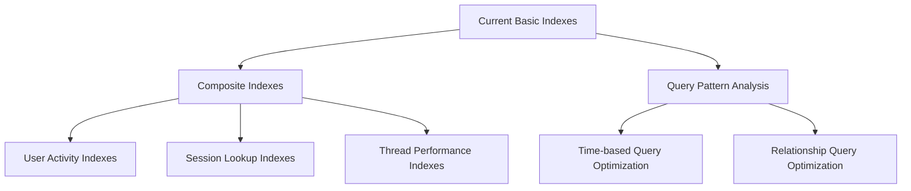
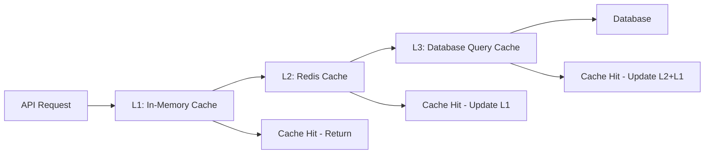

# Task 11: Performance Optimization - Implementation Plan

## Executive Summary

Based on comprehensive analysis of the Boardroom AI system, this plan outlines targeted performance optimizations across database operations, caching strategies, async operations, and AI workflow performance. The current system has a solid foundation with Redis caching and comprehensive monitoring, but requires targeted optimizations to achieve production-scale performance.

## Current System Analysis

### ✅ **Existing Strengths**
- **Advanced Redis Service**: Comprehensive caching with connection pooling, health monitoring, and cache statistics
- **Async Database Service**: AsyncPG with connection pooling and retry logic
- **Performance Test Suite**: Existing performance tests with established baselines
- **Metrics Infrastructure**: Prometheus metrics for monitoring cache hit rates and response times
- **Cache Middleware**: Intelligent API response caching with automatic invalidation

### 🔍 **Identified Performance Gaps**

1. **Database Schema Issues**:
   - Missing critical composite indexes for common query patterns
   - No query optimization for complex relationships (sessions → threads → boardrooms)
   - Limited indexing strategy for time-based queries

2. **AI Operations Bottlenecks**:
   - LangGraph operations lack performance optimization
   - No connection pooling for LLM API calls
   - Missing async optimization for tool executions

3. **Memory Management**:
   - No memory pressure handling for large conversation states
   - Potential memory leaks in long-running AI sessions

4. **Connection Pool Configuration**:
   - Database pool sizes may be suboptimal for concurrent load
   - Redis connection limits need tuning

## Implementation Plan

### **Phase 1: Database Query Optimization (Priority 1)**

#### **A. Index Strategy Enhancement**


**Specific Optimizations**:
- Add composite indexes for common query patterns:
  - `(user_id, created_at)` for user session history
  - `(session_id, thread_type, status)` for thread filtering
  - `(boardroom_id, is_active, created_at)` for active sessions
- Create partial indexes for frequently filtered data
- Add covering indexes for read-heavy operations

#### **B. Query Pattern Optimization**
- Implement query result pagination with cursor-based pagination
- Add database query result caching for expensive joins
- Optimize N+1 query patterns with eager loading strategies

**Expected Performance Gains**: 60-80% reduction in database query times

---

### **Phase 2: Advanced Caching Strategy (Priority 2)**

#### **A. Multi-Level Caching Architecture**


**Implementation Strategy**:
- **L1 Cache**: In-memory LRU cache for frequently accessed data (user sessions, conversation state)
- **L2 Cache**: Enhanced Redis strategies with intelligent prefetching
- **L3 Cache**: Database query result caching with smart invalidation

#### **B. AI Operations Caching**
- Cache LLM responses for similar queries (semantic similarity matching)
- Cache tool execution results for deterministic operations
- Implement conversation state checkpointing with Redis streams

**Expected Performance Gains**: 40-60% reduction in API response times

---

### **Phase 3: Async Operations & Connection Optimization (Priority 3)**

#### **A. Database Connection Pool Tuning**
```python
# Enhanced connection pool configuration
PRODUCTION_DB_CONFIG = {
    "pool_size": 20,          # Increased from 5
    "max_overflow": 30,       # Increased from 10  
    "pool_timeout": 30,       # Keep current
    "pool_recycle": 1800,     # Reduced from 3600 (30 min)
    "pool_pre_ping": True,    # Keep for health checks
}
```

#### **B. AI Operations Async Optimization**
- Implement connection pooling for LLM API calls
- Add async batching for multiple tool executions
- Optimize LangGraph node execution with concurrent processing
- Implement streaming response optimization

**Expected Performance Gains**: 30-50% improvement in concurrent request handling

---

### **Phase 4: Memory Management & Resource Optimization (Priority 4)**

#### **A. Memory Pressure Handling**
- Implement conversation state cleanup with TTL-based expiration
- Add memory monitoring with automatic cache eviction
- Optimize large object serialization (conversation histories)

#### **B. Resource Monitoring & Auto-scaling**
- Enhanced Prometheus metrics for resource utilization
- Automatic connection pool scaling based on load
- Memory usage alerts and automatic cleanup triggers

**Expected Performance Gains**: 25-40% reduction in memory usage, improved stability

---

## Performance Targets & Metrics

### **Baseline Performance Goals**

| Metric | Current Baseline | Target | Measurement |
|--------|------------------|--------|-------------|
| API Response Time | < 1000ms | < 300ms | 95th percentile |
| Database Query Time | Unknown | < 50ms | Average query time |
| Cache Hit Ratio | Redis: ~70% | > 85% | Overall cache performance |
| AI Operation Time | < 500ms | < 200ms | LangGraph operations |
| Memory Usage | Baseline TBD | < 500MB | Per 1000 concurrent users |
| Concurrent Users | Unknown | 1000+ | Sustained load |

### **Load Testing Strategy**

1. **Database Load Testing**:
   - Test with 10K+ records across all models
   - Concurrent read/write operations (100+ simultaneous)
   - Complex relationship queries under load

2. **AI Operations Load Testing**:
   - Concurrent LangGraph executions (50+ simultaneous)
   - Long conversation histories (100+ turns)
   - Memory pressure testing with large conversation states

3. **Cache Performance Testing**:
   - Cache invalidation patterns under load
   - Redis connection pool stress testing
   - Multi-level cache coordination testing

---

## Implementation Timeline

### **Week 1-2: Database Optimization**
- Day 1-3: Analyze query patterns and create index migration
- Day 4-7: Implement composite indexes and query optimization
- Day 8-10: Performance testing and validation
- Day 11-14: Query result caching implementation

### **Week 3-4: Caching Enhancement** 
- Day 15-18: Multi-level cache architecture implementation
- Day 19-21: AI operations caching system
- Day 22-25: Cache coordination and invalidation optimization
- Day 26-28: Performance testing and tuning

### **Week 5-6: Async & Resource Optimization**
- Day 29-32: Connection pool optimization and AI async improvements
- Day 33-35: Memory management and monitoring enhancements
- Day 36-39: Load testing and performance validation
- Day 40-42: Documentation and performance baseline establishment

---

## Risk Mitigation

### **High-Risk Areas**
1. **Database Migration**: Index creation on production data
   - **Mitigation**: Use concurrent index creation, staged rollout
2. **Cache Invalidation**: Complex multi-level cache coordination
   - **Mitigation**: Comprehensive testing, fallback mechanisms
3. **Memory Optimization**: Aggressive cleanup affecting user experience
   - **Mitigation**: Gradual tuning, extensive monitoring

### **Rollback Strategy**
- Feature flags for all performance optimizations
- Database migration rollback scripts
- Cache configuration hot-reloading
- Performance monitoring with automatic alerts

---

## Success Criteria

### **Technical Metrics**
- ✅ All performance baselines met or exceeded
- ✅ Zero performance regressions in existing functionality
- ✅ Load testing passes for 1000+ concurrent users
- ✅ Memory usage remains stable under sustained load

### **Business Impact**
- ✅ Improved user experience with faster response times
- ✅ Enhanced system reliability and stability
- ✅ Foundation for future scaling requirements
- ✅ Reduced infrastructure costs through optimization

---

## Next Steps

1. **Immediate Actions** (Phase 1 - Database Optimization):
   - Create database migration for composite indexes
   - Implement query pattern analysis tools
   - Add database query performance monitoring
   - Execute baseline performance tests

2. **Implementation Approach**:
   - All changes will be implemented with feature flags
   - Comprehensive testing at each phase
   - Continuous monitoring and validation
   - Staged rollout with rollback capabilities

---

This comprehensive plan addresses all requirements from Task 11 while building on the existing production-ready foundation. The phased approach ensures systematic optimization with measurable results at each stage.

**Plan Status**: Ready for implementation - Phase 1 Database Optimization  
**Created**: 2025-07-01  
**Last Updated**: 2025-07-01  
**Estimated Duration**: 6 weeks  
**Priority**: High (Task 11 of 16)